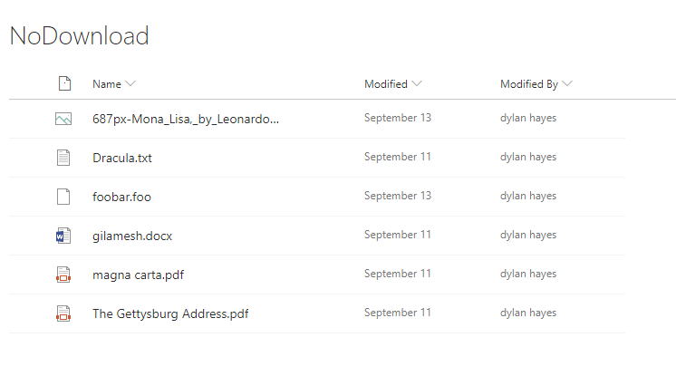

## Introduction

One of SharePoint onlines standout features for me has always been the document previews,, where clicking on a document in SharePoint would show the document in the browser with no additional tools required. These days it's not just Office documents, but a huge and growing list of different [file types](https://support.office.com/en-us/article/file-types-supported-for-previewing-files-in-onedrive-sharepoint-and-teams-e054cd0f-8ef2-4ccb-937e-26e37419c5e4).

We recently had a request wondering if it was possible to only show documents in the preview, and not allow users to download the files locally, as they wished to limit what users could do with files in terms of sharing and locally modifying these files. It turns out you can with a modern list, and it's quite easy to do, but not documented down very well anywhere. 

As ever, there are some caveats. Firstly, images are pretty easy to download if they are one screen, and this doesn't prevent copy and pasting the content elsewhere. This works pretty well on a modern browser, but IE 11 and earlier alas don't respect these settings as the document preview doesn't work.
If you want iron clad control over documents, then you should be looking at Office 365s Data Loss Prevention features. And, even then you are mearly making things harder for determined would be leaker.

## Creating View Only Permission Level

The first thing you'll need to do is go to Site Settings then Site Permissions. From the ribbon select 'Permission Levels'.

Then we can create a new permission level with some fairly tight restrictions, so that members of this group can only view a document, but not open then. You will also need to ensure the permission level has permission to 'View Application Pages' to enable users to see the list. The list section should look something like this:

Next you'll need to ensure that the permission level has permission to 'View Pages' and 'Open' under the web section, like so:

This permissions level is associated with a site collection, and can be reused across multiple lists.

## Changing the library permissions

Find the document library you want to apply this to, and then via Library Settings, go to 'Permissions for this document library'. You will need to select 'Stop Inheriting Permissions' and break the permissions that are applied to this library, and apply some changes.

## Applying new permissions

Assuming that we wish for 'visitors' to be able to only view documents, as owners and member can edit documents, we need to change the permission level of visitor. *If your groups are different the same principle can be applied to other groups.*

To do this, we need to edit the permission for the visitors group by first selecting the checkbox next to the group, and then selecting 'edit user permissions'.

The **first thing** I always do is make sure I uncheck the hidden 'send an email invitation' checkbox, which Microsoft bizzarely made a hidden default value, as I really don't want to email everyone in the visitors group.

Then, we need to select the 'View Only' permission level in the permission level dropdown.

You can use the 'check permissions' button in the ribbon to confirm that a know member of the visitors group has got view only permission, but the best test is always to try with an actual member of the visitors group.

## Testing View Only

With a user who is a member of the test account verify you can see the list. You should see something like this:

Then click on a document, and it should open in the previewer like so:

It's worth remembering this only works for supported file types (there's a lot of them). You can test this by uploading a text file with a random name and extension like foo.bar, and you'll notice the file only downloads.

## IE Spoils the party again

In modern browsers such as Edge, Chrome Safari etc, there is no One Drive sync button or any other obvious means to download the files locally.

Sadly, in IE 11 and below, the view menu on the right hand side gains an option called 'View in File Explorer':

CLicking on this opens a new tab, as well as prompting you to open a popup window which opens the library in Windows Explorer. Readonly permissions is respected, so changing local files will not change the files in SharePoint, but of course, you have just downloaded the files, which doesn't respect the permission you just setup. Not only that, but in the new tab, you can click on the files, and instead of the previewer, you just get to download the file. 
This seems like a workaround as the document previewer doesn't work properly on IE, but alas breaks the intend of our permission. Oh well.

