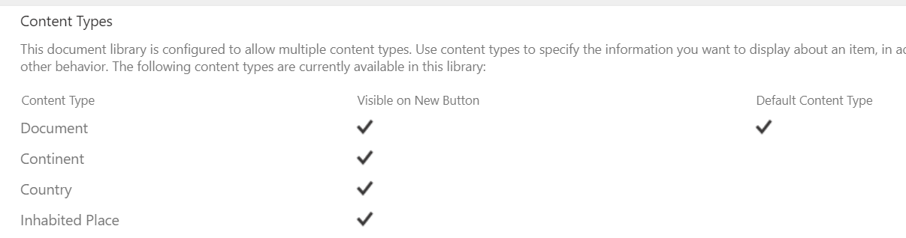
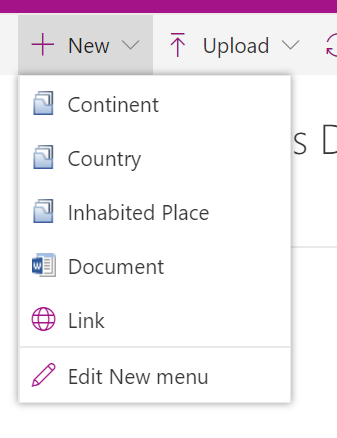
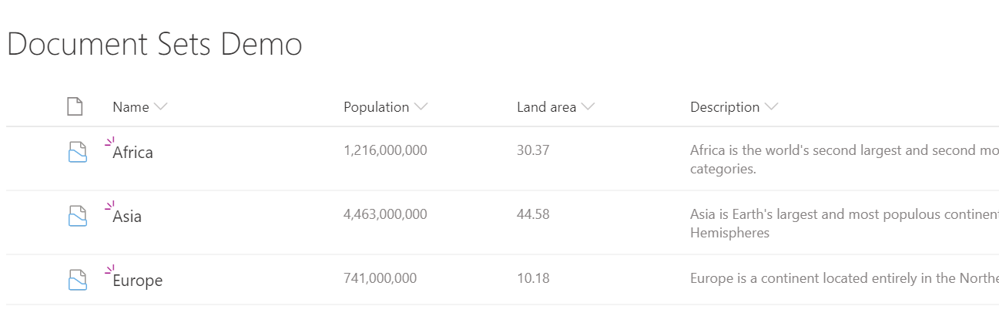
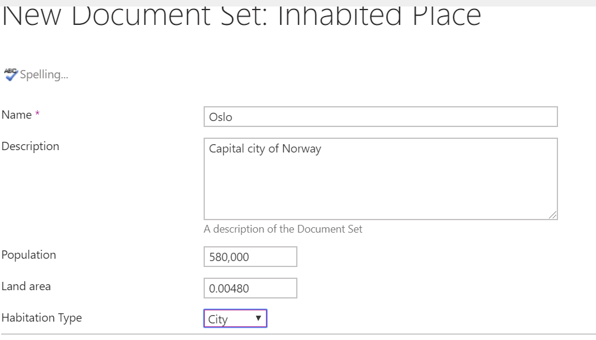
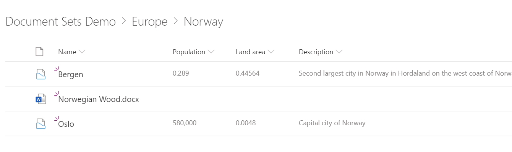

## Introduction

A much underrated feature of SharePoint, Document Sets has finally made it to modern sites. For the most part the core functionality of what document sets is still there, but there a few of the features that people have liked that are missing or not well developed. But, there's also a new feature with interesting possibilities.
The basic concepts of document sets are well covered elsewhere, so here I'm just going to concentrate on a walk through of building an example in modern that shows how they work in modern, and any major differences to old school document sets.

## Making some content types

In this case, we are going to illustrate a new feature of document sets, where the can be nested. So, we're going to create a base content type for a geograhical entity, which inherits from Document Set. This will have stuff common to all geoegraphical entities, such as population and land area. Being a document set, you get description in the mix for free. Then inherit from this base type to make a Continent, Country and Inhabited Place content. Each of these gets some extra site columns relevant to the entity, such as country code, or what sort of inhabited place it is.
As they are content types we are then going to go to the content type settings and take a look at the document set settings. We can then determine which content types can live in this document set. A couple of things to note:

* We can't have our other document sets as allowed content types. A pity, as this would be a great way to enforce a hierarchy.
* All the stuff about welcome pages, which were really useful and attractive is ignored in modern. 

## Adding to a document library

Now we can add a list, and configure the content types we want to allow. 

We need to allow all the possible document set content types we've just added, along with any of the other content types we want to us (just document in our example).

Next we can configure the new items menu to our liking. Here we want to allow our document sets.

We can then ammend the view to show stuff we care about. In our example, we want to see population and land area as well as the description, as this is something relevant to all levels of our example. With our top level document sets in place, this is starting to be meaningful.

Now, if we click on a document set, and drill into the contents we can see the contents, which is currently blank. Conspicuously absent is the 'welcome page'. Infact a document set contents looks and behaves exactly like the contents of a folder. This is most disapointing, but does offer some interesting features which we'll come to in a moment. Unlike the old style welcome page, you can't customise the way document library rendering, so the view has exactly the same columns as the root of the document library. So we don't get to display any extra columns relevant to this particular content type - although the data is still there.

## Some accidental magic happens

When I first go to this point I was somewhat disapointed. Gone was the welcome page, and it's customisation, and instead we just had a plain old view.

However, I then chanced upon an idea, and tried creating a document set at the root site, and dragged it into a document set. So, I had been able to nest a document set - which was previously impossible.
In our example, we're going to create a country document set, and a few city document set at the root, and then just drag them around to nest them as we see fit.

With a little effort I was able to build a nested structure that gave me the nice featues of documents sets, with a deep hierarchy in modern. 

## Putting it together

The nesting is a neat feature, but requires some effort to build. The ideal would be to allow document set content types to be added to the allowed content types in the document set settings of the content type, so the hierarchy could be enforced rather than built by convention.
At each level of the structure the content types document set settings are honoured, and of course you get the site columns belonging to the content type, but you don't seem to get to surface this in a meaningful way.

