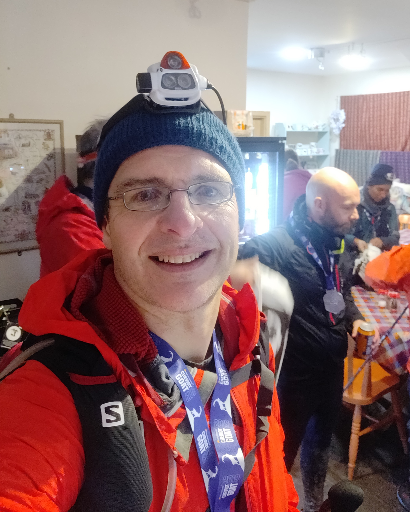

***Training, kit or attitude?***

Last year I did three ultra marathons. An ultra marathon is a run which go beyond the standard marathon distance. In this process I learned quite a lot, and not just how to run a very long way.

Indeed during the long hours of the event, and then during post event introspection I thought about if success in these endeavours was down to physical fitness, taking the right equipment or resilience of spirit.

**Hardmoors 55**. The first one of the year took place on a blustery and wet March day. My running companion at the start was faster than me, and we got off to a fast start. Unfortunately, he had to withdrew from the race. Seeing your companion get into a warm and dry car when you still had 30 miles of rain soaked and wind buffeted moorland ahead of you was a personal low point. I consoled myself with the thought that I had to keep going to the next checkpoint before would allow myself to quit, as by that point I was fed up of being utterly wet. Fortunately, soon after I caught up with a fellow competitor steadily walking the route, and we joined up for the remaining part of the race. As well as the morale boost of somebody to talk to, his assistance came in useful when about an hour after dark my main torch failed, and my backup was hopeless at illuminating the muddy paths. By the end my tired legs were struggling with steps, but I made the finish long before the cut-off time. I wasn&#39;t in good shape as it took me 20 minutes to remove my shoes and socks when I got back to the car around midnight.

**Lyke Wake Challenge**. My second was an altogether more pleasant experience in midsummer, over drier ground and a shorter distance. After a few solo hours at the start I ended up running with somebody who was a little bit stronger and faster than me, and wasn&#39;t afraid to tell me to run when I wanted to walk. Unless you are at the elite end of the race, most ultra marathons involve a lot of walking, so hard bit is ensuring you run as much as you can. Consequently I was nearly two hours faster than the previous year, and arrived at the end in good spirts still able to run on the easier sections.

**Montane Cheviot Goat**. My last run of the year was an very different experience. The Cheviot Goat is 55 miles of hilly often pathless bogs on the wild border region between Scotland and England in December and is no ordinary race. After a six o&#39;clock start, and brutal climb in the predawn darkness across bogs that were often waist deep to top of the Cheviot, conditions improved and I actually quite enjoyed the experience at times. Sometime around midday I teamed up with a fellow competitor of similar speed and inclination, and we arrived at the halfway checkpoint in good cheer. Unlike many other races, for the majority of the race there was minimal support at the checkpoints - only water every 10 or so miles, but here there was the chance to seek shelter, enjoy warm food and retrieve items from your personal drop bag that the organisers had brought to the checkpoint.  

The following steep climb onto a wind lashed hill set the tone for the next few hours. In the gathering gloom we started what I later recalled as the hardest part. In poor visibility, heavy rain and howling winds we navigated increasingly tenuous paths across a series of three boggy hills. Towards the last of these we met a straggler from a larger group that had previously passed us. She was having difficulty with her headtorch and was struggling. My companion and I decided we&#39;d help her out, as by this point we were competing against the course not each other. We stayed together across the remaining somewhat easier ground in increasingly strong winds. I found myself counting down the distance in terms of 'just' a half marathon left, then 10 miles, then a ten K, 5 K and finally the welcome warmth and light of the Ingram Café that marked the finish. We got in around 1 in the morning, which was slower than the midnight we&#39;d thought possible until we slowed to help out the straggler. Delicious soup was offered and gratefully recieved, but despite the enourmous effort, and limited food I'd consummed on the route, I really wasn't that hungry.

Oddly enough despite the far longer time on the hill and the tougher conditions, I felt I was in far better physical shape than after the first race of the year. 

*If I was to list the things that made it happen, they would be in ascending order:*

**Fitness**. Being able to sustain effort across a long, long day and still be able to summon the strength needed to attack steep climbs is non negotiable.

**Equipment**. Outdoor equipment is always a compromise between price, performance and weight, so picking the combination that best suits the task is a skill in itself. I made a series of purchases to address previous problems such as torch battery life, waterproof jacket breathability and keeping feet comfortable. I wasn&#39;t afraid to experiment with things I hadn&#39;t tried before, but new items of kit were carefully researched and tested before the race. During the race pretty much everything worked well, aside from a part of the water reservoir in my bag digging into my back very painfully after a last minute substitution of an old one which failed. In retrospect this was an entirely preventable problem I deserved to have.

**Attitude**. You can find any number of cliques about effort and reward, and with ultra marathons they are mostly true. Finishing is the about the triumph of spirt over a tired body.

**People**. In all the events at some time or other I interacted with others. From the marshals that staff the checkpoints, to the people you randomly share the race with, ultra marathons are both solitary and group efforts. In my attempt to catalogue what made the race, I'd failed to notice the most important thing of all. 
In my first race, the sudden absence of company had destroyed  my morale, and the it&#39;s restoration had rebuilt it, and helped me when my light failed. On the second race, a fellow competitor had enabled me to considerably improve my time. Given how I had benefited from the assistance of others, it was unquestionable that I wouldn&#39;t help somebody else who was having a bad race.

Inevitably, runners will talk about what kit they used. It&#39;s a very personal thing, but I felt I was well equipped for the last race. Deserving special mention would be:

- **Leki RCM carbon poles**. Running with poles is strange, but most of the competitors other than the very fastest used them. Being able to literally test the waters of the many bogs was invaluable, and worth the extra weight.
- **Petzl Nao+**. Having lots of light for a long time is essential for a winter ultra marathon. The clever technology in the Nao adapts the output to the environment, by reducing power output when not needed, helping the battery last a long time. On the default settings it managed 9 hours of use finishing on 25% battery, and aside from the odd time I had to turn it up to full beam to navigate around obstacles there was plenty of light.
- **Garmin Fenix 5**. I hadn&#39;t used the navigate functional before. It worked well, as it showed a dotted line to follow on the watch face, and beeped angrily when I strayed off trail, which is handy when the watch is invisible under extra layers. The battery lasted 18.5+ hours only failing in the last 1 km.
- **Montane Minimus Stretch Ultra jacket.** More breathable than my previous jacket, although I only bothered to put it on once the rain started in earnest.
- **Montane Primino top**. Comfortable when wet, it and a lightweight fleece kept me warm in 4-6 degrees C with moderate winds.
- **Montane PowerStretch gloves**. Warm enough even when wet in the wind, although when it got cold on the Hardmoors 50 I needed to swap to something warmer.
- **SealSkins Knee length socks**. Waterproof socks are handy in winter, as even if they don&#39;t stay perfectly dry inside, your feet stay warm and comfortable. I had used shorter ones on other races, but decided to go for something longer. The extra length was handy when crossing bogs and wading the occasional stream, and kept my calves warm and mostly dry. After 19 hours outside my feet emerged warm and comfortable.
- **Dexshell windproof beanie hat**. I carried a buff as well, but the extra insultation from a windproof layer meant not having to put my hood up which feels very isolating.

**Photos**

