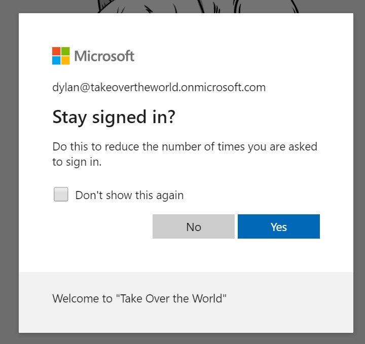

We're all using two factor authentication on Office 365 right? 
If you are not, stop reading this now, and turn it on.

Two factor authentication (2FA) is also called 'Multifactor authentication', and this 
post is here to remind you it's not just about using your phone to approve logins. 
Although there's been quite a bit of talk about the venerabilities of SMS based authication, 
authentication apps such as Microsoft and Google's respective Authenticator applications are still 
an improvement over passwords alone. However, not every use case fits this.

Many organisations choose to have emergency 'breakglass' accounts armed with powerful privilidges 
with the credentials physically secured (e.g. locked in in a safe) for use just in case all of the 
other administrative accounts are unavailable. On the face of it, this is a wise move, as inevitably a 
problem might occur when you are least prepared for it. Accounts could be compromised or the regular admins unavailable.

Having enforced 2FA for user accounts, what you are going about the 'break glass' account? 
Having a really secure password that physically secure is still a password, and mobile based 2FA 
depends on a particular person having access to a certain device, which defeats the point 
of such a account.

Smart cards have been around for a while for logins to Windows, but we want to login to an online account.  
The industry has developed various standards to do this, and it's starting to go mainstream. 
Azure Active Directory now supports FIDO2 security keys (in preview at time of writing) not all FIDO2 keys. There's quite a few vendors of such keys, but I found it 
quite hard to figure out which keys would work with Azure AD. Although you can buy a super cheap 
key online which claims FIDO2 support, I'd be reluctant to stake so much on something I wasn't sure about on many levels. 
In end I plumped for a Yubico YubiKey 5 NFC, as reviews and the documentation seemed to indicate it would work.

We'll zoom in on the setup effort in future post, but right now I want to walk through the process of actually logging in, as it's the ease of this that makes the AAD bit worth doing. 

##Step by step

Step 1. I either logout, or open a incognito window in a browser, and head to the Office.com login page.

Step 2. When I see the login dialog I hit the 'Sign In Options' link. Then, subject to 
having the most recent updates installed, I select 'Sign in with a security key'.
 

Step 3. When I'm prompted I insert the security key. 

Step 4. I enter the PIN that belongs the key.

Step 5. I'm prompted to touch the key which is now blinking. 

Step 6. I choose which account's credentials I want to check. It's possible to stack multiple accounts of to one device, and in my 
demo, I have it setup with a dev tenant and my personal Microsoft account.

Step 7. I'm authenticated, and I'm prompted if I want to stay signed in.

Step 8. I'm logged in. Happy days.

##Recap##

So, let's just reply what's happened here. I've just logged in to an account, but I haven't been asked for a user name or password. 
Entering a PIN slows the process down a little, but the PIN ensures accidental possession 
of the key doesn't grant access. 

It took me a while to figure out why I needed to touch the device during the process, but then, I thought about what if a person had left the device plugged in and left work for the day? If the attacker could remotely access that machine, and had obtained the PIN nothing would stop them. Now for it to be maliciously used, the attacker would need the more than just good luck but active assistance from the token possessor.

Next article will be the setup phase. I'd like to test the robustness of the device, as I'm pretty adapt at destroying stuff, but unfortunalty didn't have it last month when I did the [Cheviot Goat](https://dylanhayes.github.io/Lessons-from-Ultra-Running/), so I guess I'll have to wait until my next ultra marathon.

