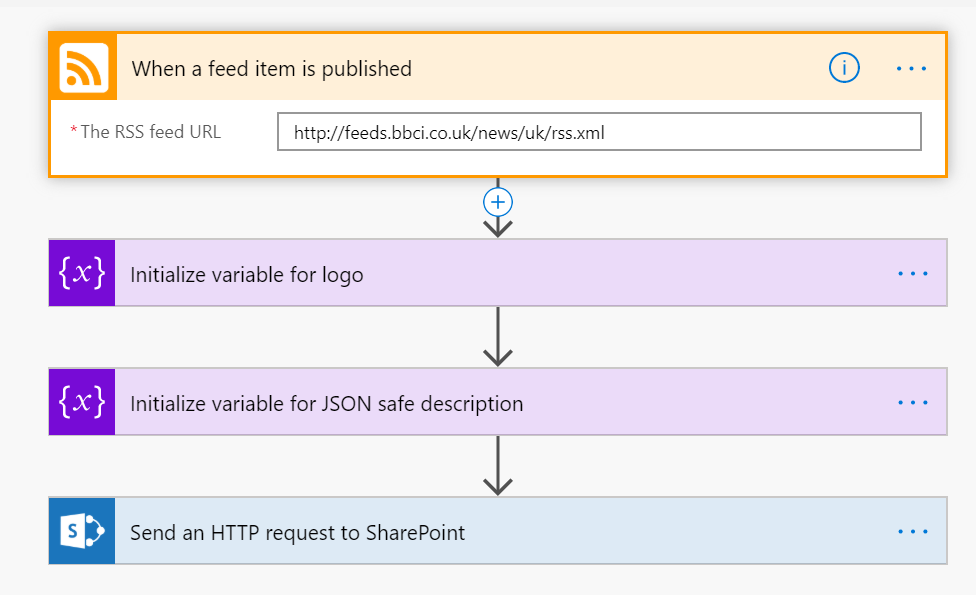

## The problem ##

RSS has been around for a while. A staple of many a SharePoint intranet of yesteryear was a couple of RSS web parts showing industry news. RSS is no longer quite so popular, and Modern SharePoint doesn't have a native RSS web part anymore. But the requirement hasn't entirely gone away.

There are some 3rd party RSS web parts, but none of them offered a very pleasing solution. 

## Power Automate and a formatted list ##

Step forward Power Automate's RSS connector. The obvious solution is create a Power Automation triggered by the RSS connector, which puts new RSS feed items into a SharePoint list. Add in the secret sauce of a view formatter, and a nice looking RSS feed can be yours. By choosing to put multiple feeds into one list, you can make one consolidated view, or filter the views by origin to separate out the items as required. With a fairly simple view formatter, an attractive RSS feed is possible with limited effort. However, we have to make all the effort to do the formatting, and any changes mean delving in to the JSON that does the formatting.


## Power Automate and News ##

A list just felt like a missed opportunity to me. There's been a lot of investment in making SharePoint news look great and offer some really flexible web parts. As well as regular 'news post' pages, since the summer of 2019 there's also 'news link' pages. Surely an RSS feed item is well modelled by a news link?

Alas, there's no action in Power Automate to create a news page, or indeed a news link page. However, I turned on the developer tools in the browser, and observed the traffic when I used the UI to add a news link page. It turns out it's actually a pretty simple POST to a REST endpoint with a payload of the link, title, description and image. 

``` javascript
{"BannerImageUrl":
"https://www.microsoft.com/en-us/microsoft-365/blog/wp-content/uploads/sites/2/2020/01/Microsoft-Edge-FB.jpg",
"Description":
"Microsoft Edge saves you time and helps you focus by delivering a fast and secure way to get things done on the web. 
Today, the new Microsoft Edge is out of preview and ready for download on all supported versions of Windows and macOS and in more tha",
"IsBannerImageUrlExternal":true,
"OriginalSourceUrl":
"https://www.microsoft.com/en-us/microsoft-365/blog/2020/01/15/the-new-microsoft-edge-now-available-for-download/",
"ShouldSaveAsDraft":false,
"Title":"The new Microsoft Edge now available for download - Microsoft 365 Blog",
"__metadata":{"type":"SP.Publishing.RepostPage"}}
```

With the aid of a HTTP action we can certainly do that in Power Automate. By subsitution of the values I had captured with the values provided by the RSS connector, I was able to create a new news link page every time a new item got added the the RSS feed (have I said 'new' enough?).

## Putting it all together ##



When you add a link via the user interface, SharePoint goes off and grabs the title, description and image for the post before it POSTs back to the endpoint we're going to hit. The RSS connector doesn't have any concept of an image for each item, so we don't get to have an image for each item, which is a real shame as that really would be the cherry on the top of our delicious RSS cake. The simple solution is to simply upload a generic image (such as the logo for the RSS feed provider) to a known location in SharePoint like the assets library and stick that URL into the image part of the POST payload - to make the POST code easier to read we're going to put this into variable. This works OK, but feels like we're not taking full advantage of the features of news. 


After I got my proof of concept, it didn't take long to notice that some stories would fail to parse. A quick examination of the error showed that double quotes inside the content was mangling the JSON. With the aid of a bit of search and replace on the offending string this was soon fixed.

```VBScript
replace(triggerBody()?['summary'],'"', '\"')
```

Note how we escape the double quote with a \ inside the single quotes.


Now we can come to the fun bit where we create our post:


## And now, here is the news ##

At this point we've got a workable solution, and we can add a news control to a page and play around with the output. There's lots of different options for how the news displays, so we're sure to find something that suits our needs. As our RSS feed is creating news, we may decide that we want this content mixed in with our own internal news, or more likely we'd like to segregate it from our internal news. By putting our RSS derived news link pages into a separate site, this lets us easily filter out RSS derived news from the news web parts elsewhere in the other sites simply by selecting which sites we get news from and making a point to exclude the RSS site. I'm anticipating that news will eventually get richer ways to classify each story, and this would provide a better solution in future. 

## Going further ##

I wasn't happy with the generic image for each RSS item, especially as that's not what you see if you add a link via the UI. The better solution would be to add some further steps to our flow, and go off and page scrape the destination of the link to get ourselves a  image for the story. We could try and parse the HTML to look for the main image, but HTML parsing is always tricky. Fortunately, there is a standard solution to this problem, although, as always there's no absolute certainty that every page will have this. But many bigger news organisations provide an 'og:image' metatag with our image in the header and an example looks something like this:

```HTML
<meta property="og:image" content="http://ia.media-imdb.com/images/rock.jpg" /> 
```

However, it turns out that at the time of writing the seemingly simple task of grabbing some content from a webpage isn't simple, so we'll cover this in a further blog post about [2020-02-01-Extracting-metatag-from-webpage.md](parsing HTML with Power Automate).
