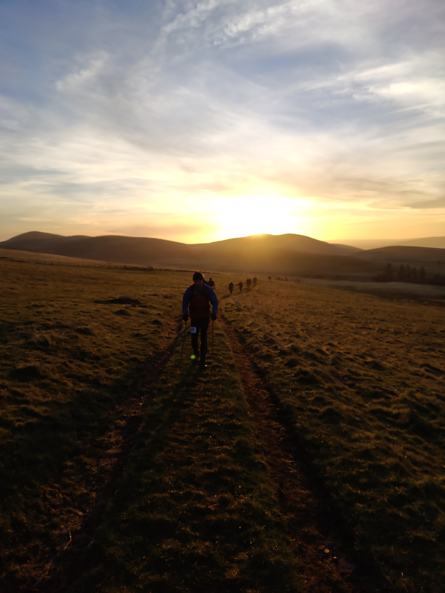
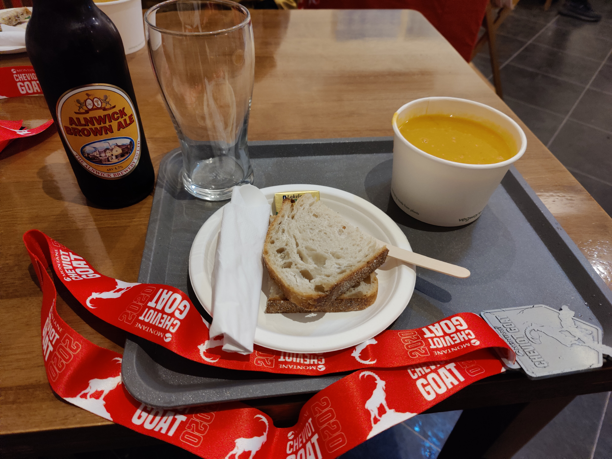

_Lessons from the intersection of mountain goats and technology_
## There's a bit of a reoccuring theme here right? ##

Last month I did the Cheviot Goat 2020 edition. Or was it the 2021 edition, or the spring 2022 edtion? With 2 cancellations due to covid and one due to storms this an event that had been a long time coming.

I'm now done this [sort of event quite a few times](https://dylanhayes.github.io/Lessons-from-Ultra-Running/), and I can compare what common threads there are to each event and what is distinct. The [Cheviot Goat](https://cheviotgoat.com/) likes to emphasise the remote and challenging nature of the course and the fearsome weather conditions. At dawn on a late March day with a cloudless sky there was skant sign of the fearsome weather, and the first couple of miles along wide easy paths was far easier than it was on the previous route where this was the very last section done on tired leg in the dark howling night. If the the Cheviots are Middle Earth, then we were still on the edge of the Shire. 

In a pattern that became all too familar, the route then left the comfort of a gravel road, and headed across progressively rougher ground, litterally uphill and down dale. By this time, I had done what I often do, and teamed up with somebody else whom I though would have a similar pace. We mixed running and walking over ground I had covered before going the other way on the previous race. Pleasant weather and daylight made what I had thought horrid at that time an enjoyable jaunt. On a sunny day, the aid station at Barrowburn was a place of optimism and refreshment. On the previous race, this marked the end of the easier part, and the coming challenge of darkness and storms.

The pattern of abrupt climbs and descents on a mixture of landrover tracks and sheep trails across rough ground countined until we reached the aptly named Windy Gyle. One of the distinct features of this race is the dour and gloomy place names. Murder Cleugh, Bloodybush Edge, Wether Cairn, Butt Road and High Bleakhope are unlikely to feature in outdoor product names like Lakeland fells do. Having been hot during the climbs so far, the wind started to feel really cold along the Pennine Way. The stone slabs were quite runnable, although it was very easy to catch a toe on protruding bit, sending you tumbling into the surrounding mire. Worse yet, there were gaps in slabs. With a combination of luck and judgement you could tell if the gap was where the stone was concealed by a shallow muddy puddle, or a bottomless pit of filth before placing a foot into it. We arrived at the unexpectedly cloudy summit plateau of the Cheviot after making good progress. The descent from the Cheviot proved to be a unpleasantly rocky at first, and then a nighmare for poor grip on the heal of my Hoka Speedgoats. I was at times speedy on the Goat, but mostly because I was sliding downwards on my behind.

After a dull section we arrived at the junction of the path from Bloodybush Edge and Salters Road. On my previous race, the descent from the howling wind on Bloodybush Edge to the relative calm of the valley, and the knowledge that the rest of the route was easier brought such a warm feeling, I still felt an echo of it two years later. The climb up Bloodybush Edge was far easier than coming down in the dark, especially as we stayed to the west of the fence. If you are reading this looking for top route finding tips, stay right of the fence is the one to remember. The light was fading fast as we approached Cushat Law. This was a section I previously remembered as really hard (going the opposite direction), but either daylight, or shifted expections about what was hard made for steady progress over the boggy but not pathless ground. Our aspiration was to have made the second aid station by nighfell, but it was very dark  by the time we rejoined the Salters Road. After a visit to the aid station located in the barn at High Bleakhope, it was time to press on in the dark. Seeing the red tinged full moon rise over the hills was the one positive moment in what was otherwise a very, very tough section to Hedgehope Hill. The route followed a series of fencelines, and at times there was something approaching a followable path, but at other times, forward progress was blunted by wading through waist deep heather. 

It was somewhere in the heather below Little Standrop that my Garmin watch announced it was out of power and shutdown. People say "if it's not on Strava, it didn't happen", but my watch was also my primary navigation device. My running companions watch had also done the same. This was not a way marked route, and a concious effort to navigation at all times was required. I had the route on my phone, and a paper copy, but by this time in the cold and increasingly fierce winds the watch was clearly the better option. I had purchased a Fenix 6 in anticipation of the better battery life and powersaving options, so this was a suprise and disapointment to me, but not one I was unprepared for as I had a Zendure 10,000 mah powerbank and a cable. In my haste to get the watch charging in my bag, I forgot to press start, so the next hour of the route was unrecorded until I got the watch out to wear it again.

The relief at leaving the heather behind was shortlived, as the savage wind ruled Hedgehope Hill, and we were blasted by freezing air. However nice the day had been was all forgotten, and even with all my layers on it was hard to get comfortable. By midnight it was cold enough for all the mud to start to freeze hard again. Once down from the hights of the ridge, conditions improved considerably with the cold wind abated. Even the notorious swamps of Dunmoor Hill seemed quite easy to circumvent. Before long, our descent to the valley began in earnest. As ever, finding a route was never easy in the dark, but eventually an iron gate opened to reveal the welcome feeling of tarmac underfoot.

We might have lost interest in the route by this point, but the route wasn't done with us yet. The dark mass towering in the moonlight to our right was Brough Law, and a quite unwarrented twist to the course which added a further 150 metres of climb to an already hilly route at the point where a sane person would have carried on for a few more minutes brisk walk on the road to the edge of Ingram Village. Tired legs suffered on both the climb and the descent, and we joined every other competitor in cursing the cruel and unusual punishment the race organisers had saved for us. 

We arrived a few seconds past 03:00 in the morning. This was much slower than last time. A full two hours slower. A slightly longer course, harder ground conditions, more climbing are all valid reasons for the additional time. Being less fit after Covid, and a general desire to take it steady and not injure myself again are also valid. Ingram Cafe was able to provide a welcome warm soup, and a cold Alnwick Ale. I can't decide if that was the weirdest breakfast ever, or the perfect postrace pick-me-up. Sleeping in a car after an event is very seldom easy or pleasant, but after the inevitable painful process of getting changed for bed and inspecting the damage to my feet, I found the sleep I needed for a few hours.

## Lessons learned ##

- **Technology works**. Except when it doesn't. Knowing I was going to be out on the course for a long time meant carrying more than somebody much faster than me who would finish in the daylight. Consequenly, I took:
    - Two  powerful head torches, two to avoid a single point of failure, as progress without lights would be near impossible. A previous problem with a main light had taught me that the backup needed to be as good, not good enough.
    - A newish Garmin watch that I assumed had enough endurance to last the course. Whoops. Not quite sure why it failed to perform as expected.
    - A Zendure 10,000 mAh Power Bank. I had panic purchased this just before the race, as I decided my 5,000 mHa one was getting old, and wouldn't have enough capacity. It was expensive but offered a lot of juice for the small size and weight. A wise choice as my phone burnt through a full charge in the first part of the day when it struggled to connect to the mobile network, and my watch needed a full charge. It still had enough charge left to fully charge another device. When I return next December, with the difficulty turned up a notch or two, with longer and colder nights, that extra capacity may get used.

- **Experience Counts** I went into the race less fit than last time, and although the weather was better, the course was longer and harder. Last time, I could bearly walk for a week afterwards. This time I was fine. Possibly as I took it slower and was careful to moderate myself, I was able to finish in better shape despite being less fit. My loss of fitness was compensated by experience and the knowledge that I had run 50+ miles many times before.

- **Everyone has a plan until they get punched in the mouth"**. My watch unexpectedly ran out of battery. The terrain proved far steeper and harder going than expected. The warm sunny spring day became a fierce freezing gale after dark. Things go wrong, but preparation, experience and solving problems in real time can save the day.

- **Memory is unreliable** When I did the race, I crossed my previous path of two years ago (the course is different but shares sections). At the time, I felt nostalgic for the feelings of horror and elation I felt in Decemeber 2019, and was disapointed at the lack of these this time around, as I found some of the day OK and some of it pretty miserable, but never as emotional as I remembered the previous race. As I write this nearly three weeks later, enough time has passed for me to feel as equally nostalgic for this year's event as the previous one. I'm not quite ready to say fond memories yet, but I'm sure a few more months will allow me to fool myself into thinking it was pure enjoyment. The fun thing about Type Two fun, is that your perception of the enjoyment changes dramatically once a few weeks have enlapsed.
