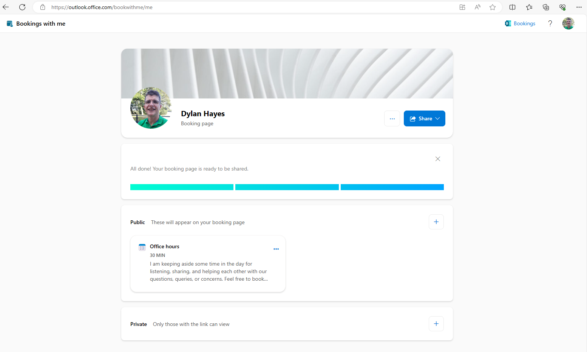
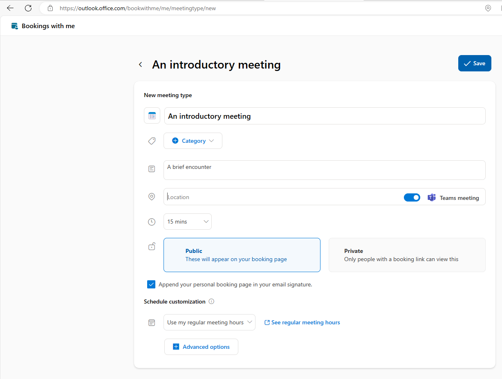
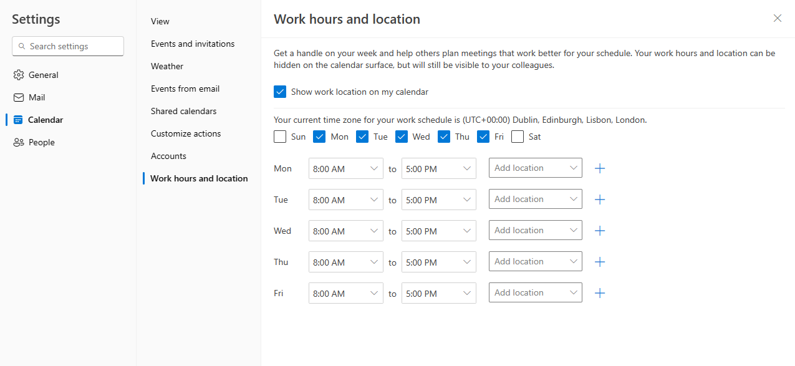
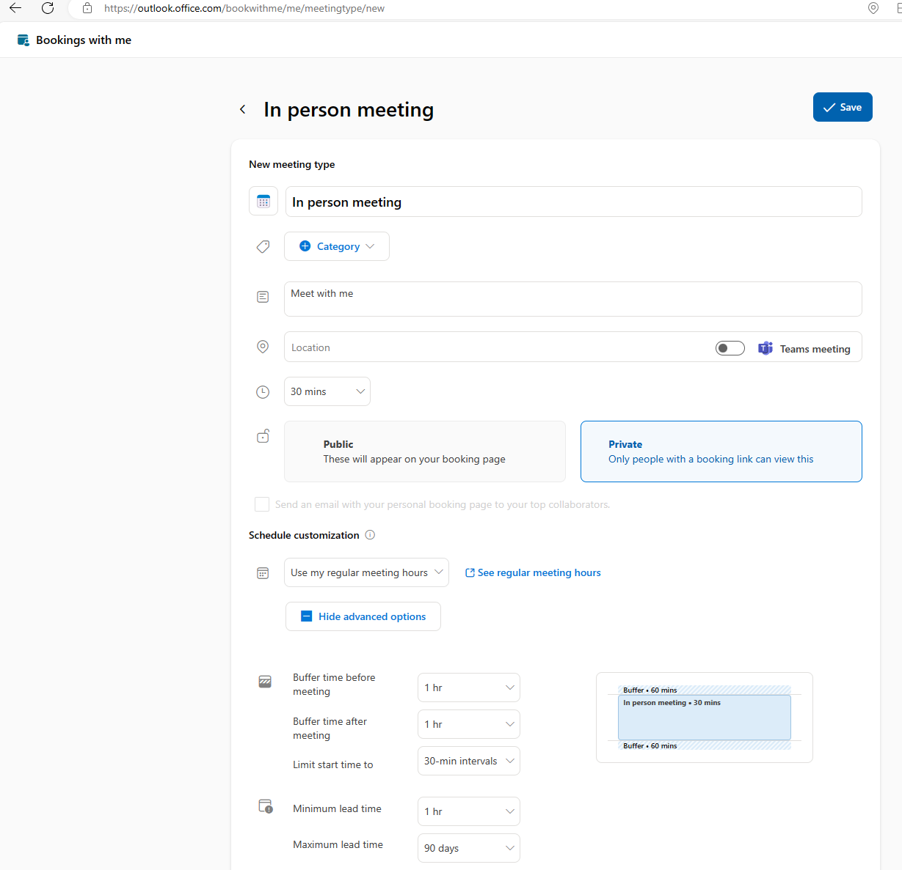

It's likely that millions of emails fly around the internet every day try to solve a very simple problem: What time shall we meet?

## There is salvation from this tedious task ##

There are 3rd party services out there which can do this for you, but it turns out Microsoft 365 can do this for you already as part of your existing license. In fact, as is often the case, there's actually two ways to do this. Each of these is optimised towards a slightly different use case but broadly do the same thing.

### Book Time With me ###

This is actually the newer option, but it's generally the easier one to get started with.

If you go to [https://outlook.office.com/bookwithme/](https://outlook.office.com/bookwithme/) you will find the first, called Book Time With Me. As the name suggests, this is aimed at your personal work persona, and offers an easy way for colleagues and collaborators both internal and external to find a talk to book some time. 

A default private meeting is created to get you started. You can add your own additional meetings afterwards to suit your needs, so that you can offer different types of meeting by duration and purpose.

It's very easy to create new meeting types and start using the service, but some thought needs to be given to how it will work at a practical level. 
The first mistake you can make is to not keep the rest of your diary fully up to date. As availability is driven by your Exchange calendar, your calendar needs to be really accurate. 
If you have booked time off, make sure you mark yourself as unavailable in Outlook the moment you book that time off, as otherwise somebody with a link to your bookings page can quite innocently book some time with you where you are not available. Your time savings from using Book With Me are soon eroded by having to fix this.

The second mistake is to not define your available hours correctly. By default, Exchange considers your day to start at 8 and end at 5. If you don't work those hours, somebody might book time with you outside your working day. Just head to [workSchedule](https://outlook.office.com/mail/options/calendar/workSchedule) to configure this to your needs. 

You can override the regular meeting hours for a specific meeting. For example, if you have a meeting type for a software demo, you might want to limit which days and times you do this to allow time to prepare.

The next pitfall lies with buffer time. Nobody enjoys back-to-back meetings, but unless you add some buffer time around your meetings, the booking system will happy allow back to back meetings. When a particular type of meeting involves preparation (or there's a danger of a previous meeting running late), adding some buffer time before meetings can help preserve your sanity. Speaking of buffer time, I find it good practice when you have regularly scheduled meetings in your diary to add a bit of buffer before and after them to stop the booking system adding an appointment right before or after that meeting.

Until now, we've been concerned with phone and video calls. Although we just learned about the importance of keeping your diary in tiptop shape and allowing buffer time, what happens if you want to offer the ability to book a meeting that involves travel? Although we can add buffer time, we don't know how long it will take to journey somewhere.
Here's how I do this. It's not perfect, but it still removes some of the hard work. 

First, I create a Private meeting type for an in person meeting. This means only somebody with the link can book. In the meeting type I set it to private, turn off the Teams meeting toggle, and add a generous buffer. I might also choose to add some lead time to allow sufficient time to prepare. I might also tweak the available times to suit my preferences, as you probably don't want an in person meeting at 4:00 PM on a Friday on the other side of the country.

I then carefully check my diary is fully up to date. As mentioned previously, blocking out some entire days, and setting generous buffers around existing commitments can help steer the available times to best suit your needs. I then email the private link to the person I wish to meet with. The moment I get the confirmation email, I then add a big buffer either side of the just booked meeting to allow sufficient travel and preparation time. It's by no means perfect, but even with the additional effort to rigorously tend your diary like a garden, it's still an easier and more customer friendly way to let people choose a time to talk.

Lastly, once you have set up a few meeting types to suit your needs, don't forget to add some reminder messages for each meeting to ensure the meeting is not forgotten. I'm fond of adding my mobile phone number to the reminder, so in case the person you are meeting is having a problem connecting to the meeting, they have a backup way to tell you this.

### Microsoft Bookings ###

Before Book Time With me, there was 
[https://outlook.office.com/bookings](https://outlook.office.com/bookings). The intended audience is slightly different, and there's more to customise, but the intention is much the same. This will be covered in a future blog post.

