Last time we talked about a simple way to answer the question "What time shall we meet?"

## This time we're taking a look at Microsoft Bookings ##

There are 3rd party services out there which can do this for you, but it turns out Microsoft 365 can do this for you already as part of your existing license. In fact, as is often the case, there's actually two ways to do this. Each of these is optimised towards a slightly different use case but broadly do the same thing.

### Microsoft Bookings ###

This has been around for longer than [Book Time With Me](/bookingtime), and although these both superfically do the same thing, this is aimed at more complex scenarios. 
I still use this as my primary tool for allowing others  to book meetings with myself, as I was using this before Book Time with Me came along,  but the intended use case for this is when you want user to be able to book from a pool of people, customise the experience, or use this to trigger other actions. 

#### Getting Started ####

If you go to [https://outlook.office.com/bookings/](https://outlook.office.com/bookings/) you you get get started with Bookings. 

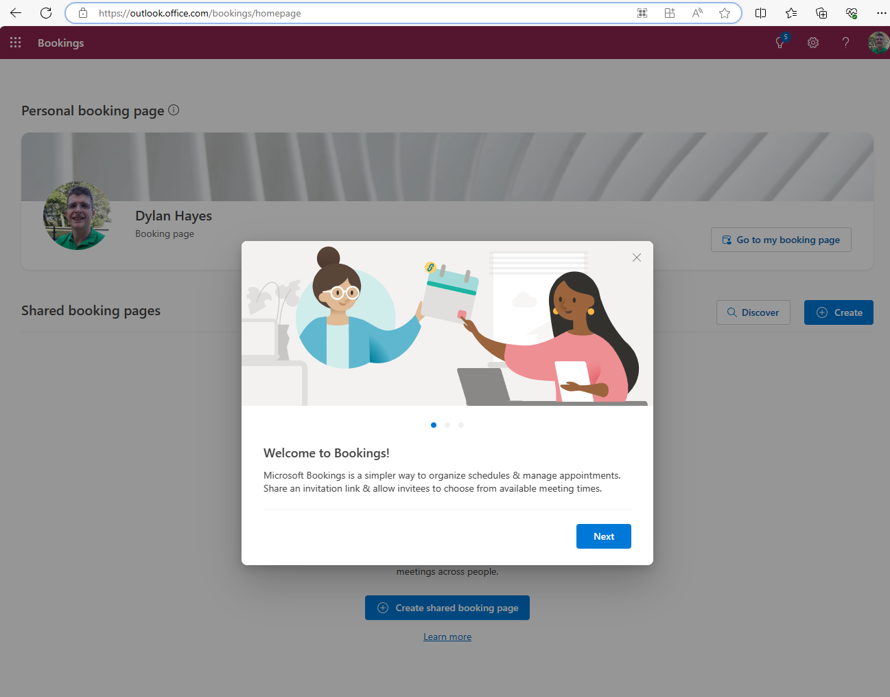

Just like [Book time with Me](../bookingtime/) you can use this to setup a booking page for just yourself. Unless you want to have really fine grained control over your booking page, Book Time With Me may well be the better option. Here, we're going to set up a simple booking page for a group. What is a group? That's a good question, as a group can have many members, and you can customise which members are available offer services belonging to the group, but broadly a group should be a pool of people who perform similar actions. This could be anything from canine beauty treatments to ghost removal services.

First we're going to add some basic details.  

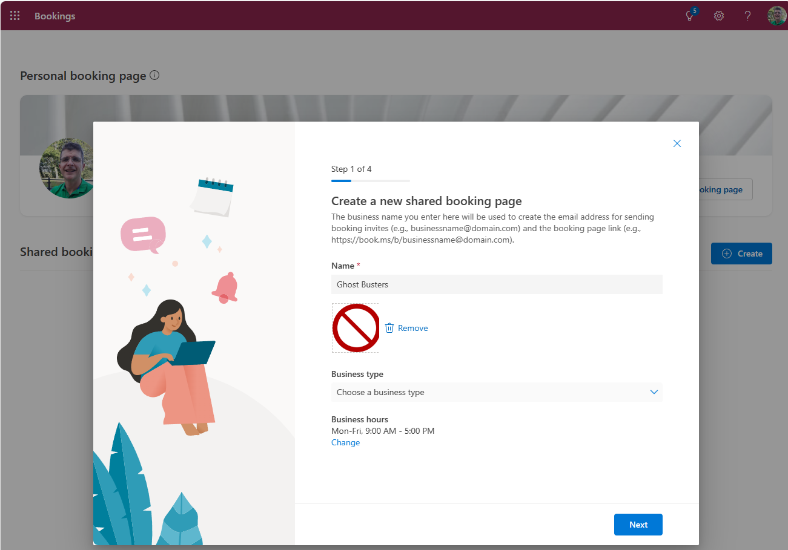

And now some other (licensed) users who will be providing the service.

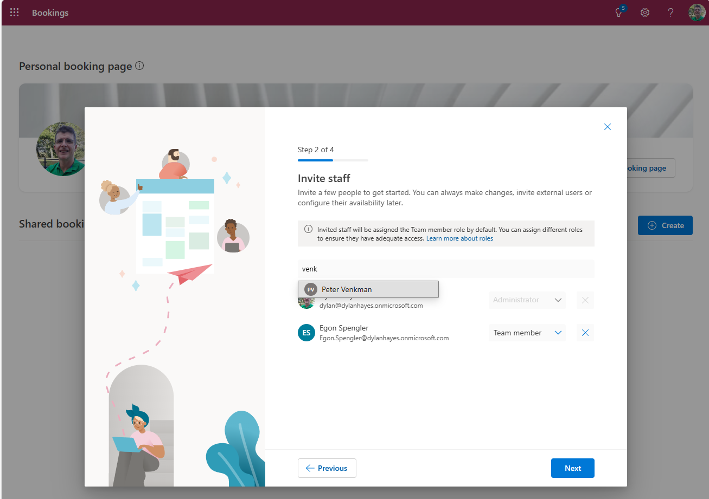

For now, we'll accept the defaults and add them as team members.

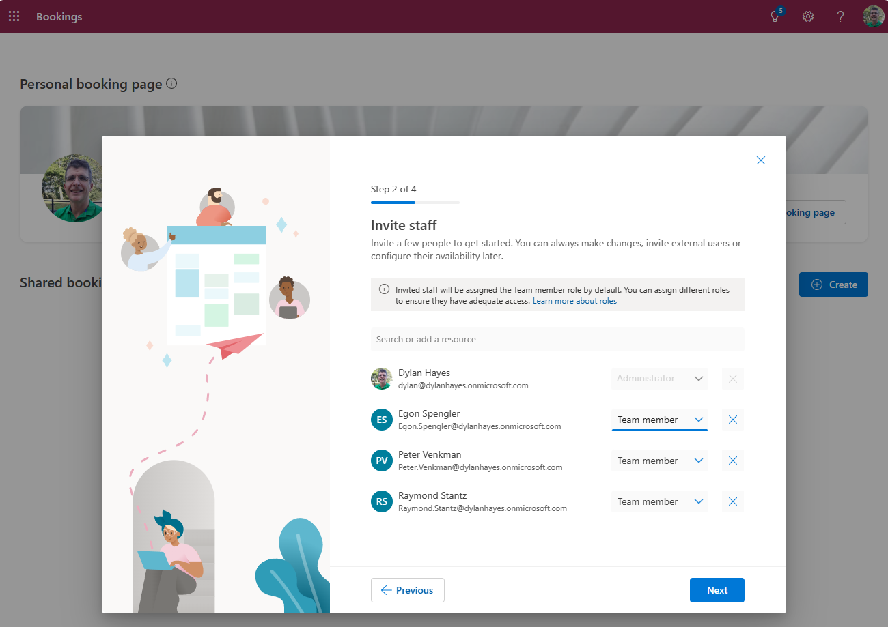

Now, we can create our first appointment type, and set the hours. We'll only set this up for office hours, but you can adjust this to suit your needs. You'll need to choose if this is a teams meeting. Just like book time with me, this respects diary availability, but because it's a group, the selection of available times will be wider as there are more staff to cover it.

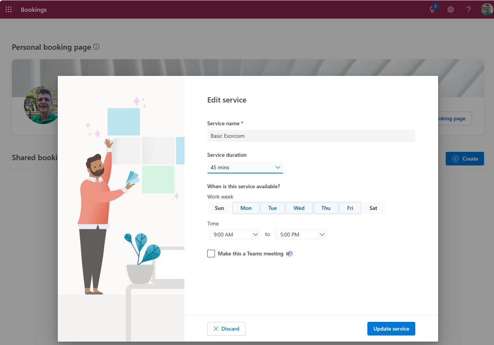

Pretty soon, the booking page will be created. 

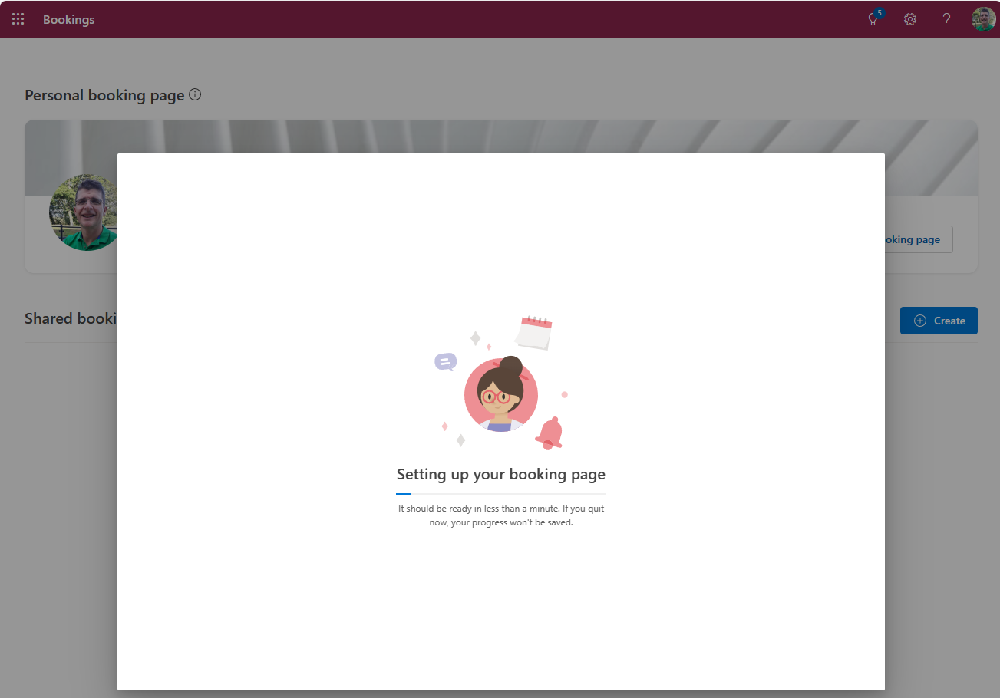

You'll get a URL for the booking page. 

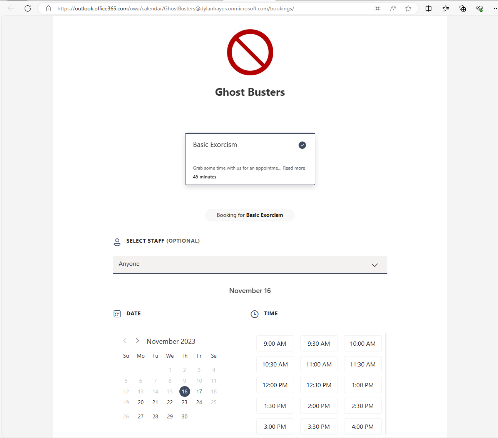

You can come back to the booking admin later to add your own additional meetings to suit your needs, so that you can offer different types of meeting by duration and purpose. But, right now, let's look at the [user experience](https://outlook.office365.com/owa/calendar/GhostBusters@dylanhayes.onmicrosoft.com/bookings/).

For now, we just have one service type, but later on, you'll be able to choose from all the services you have made available. You can also have direct deep links to these, and private service types will not show up in the list. 

The person making the booking can request a particular team member if that's what they want, which will further filter the available slots. They then choose an available slot for the service and the person. 

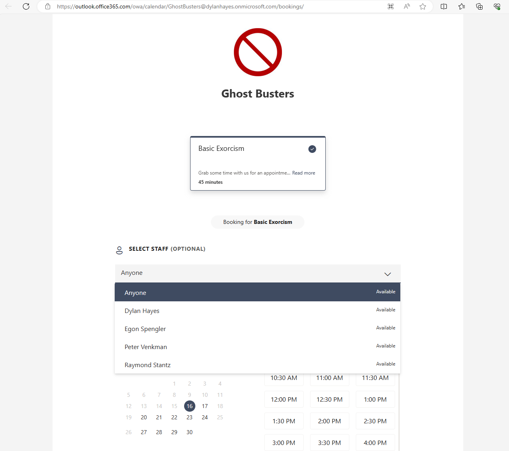

And then provide some details.

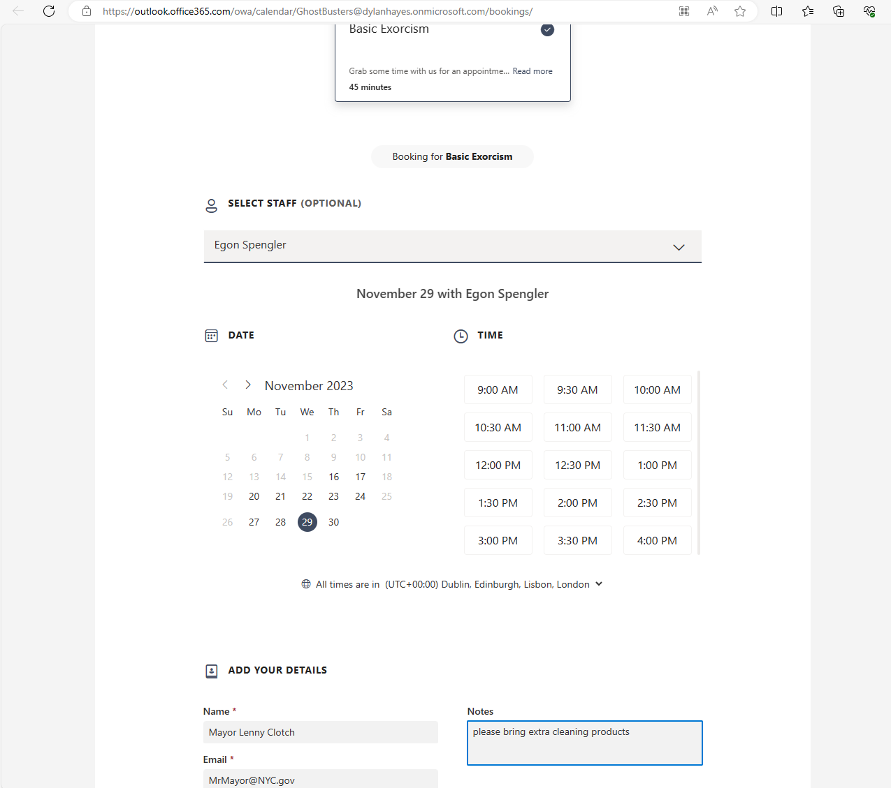

Once they hit book, they are presented with a confirmation page, and a confirmation email, which allows rebooking and cancellation.

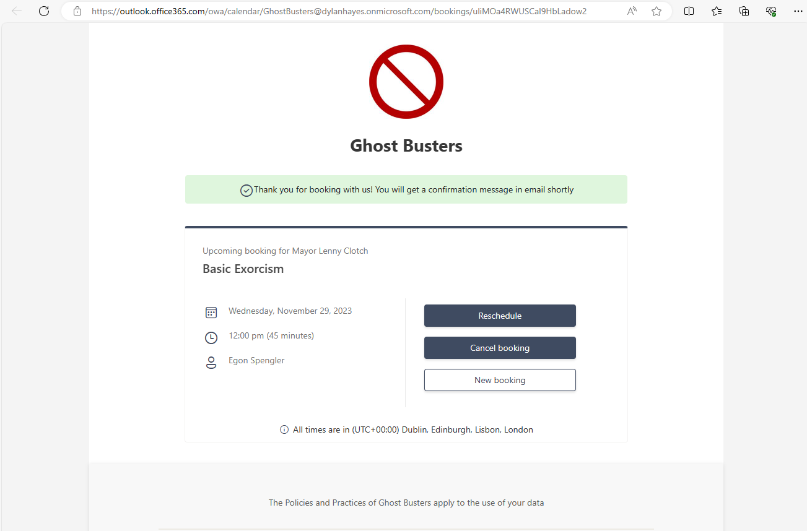

In my opinion, the experience looks very professional, which reflects it's intended use. And, that's pretty much it to get up and running.

[Try it for yourself](https://outlook.office365.com/owa/calendar/GhostBusters@dylanhayes.onmicrosoft.com/bookings/)

#### Fine tuning ####

[The Booking Page](https://outlook.office.com/bookings/homepage) is where you can add more services and fine tune the offering. 

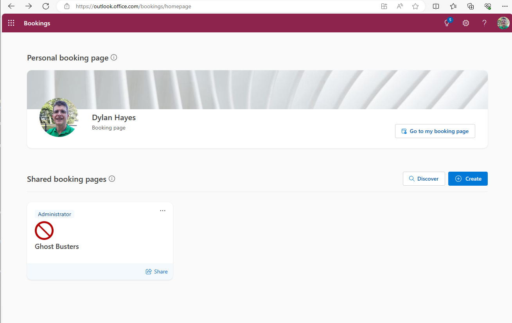

There's a lot to cover here, which we'll come to in a future blog post. Before you invest too much time, it's worth taking a look at some of the [pitfalls](../bookingtime/#pitfalls) in the Book time with Me blog post, as many of them, particularly the advice about keeping diaries perfectly maintained are euqally as valid.

### OK - Which tool should I use? ###

It depends on what you exact needs are. Generally, if you don't know, you probably should choose Book Time with Me. If you want to have fine grained control 
over the experience, Bookings.

Here's a summary by features:

| Feature                |  Microsoft Bookings  |  Book Time with Me   | 
|------------------------|----------------------|----------------------| 
| Easy to setup          | Yes                  | Very easy            | 
| Group Booking          | Yes                  | No                   | 
| Customised Emails      | Yes                  | Limited              | 
| Private Meetings       | Yes                  | Yes                  | 
| Internal Only Meetings | Yes                  | No                   | 
| External Meetings      | Yes                  | Yes                  | 
| Extension points       | API & Connectors     | No                   | 

