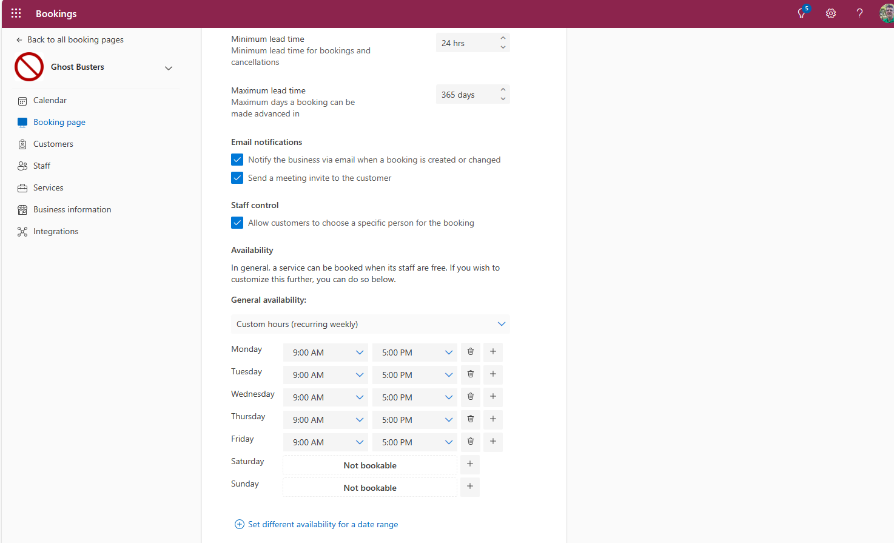
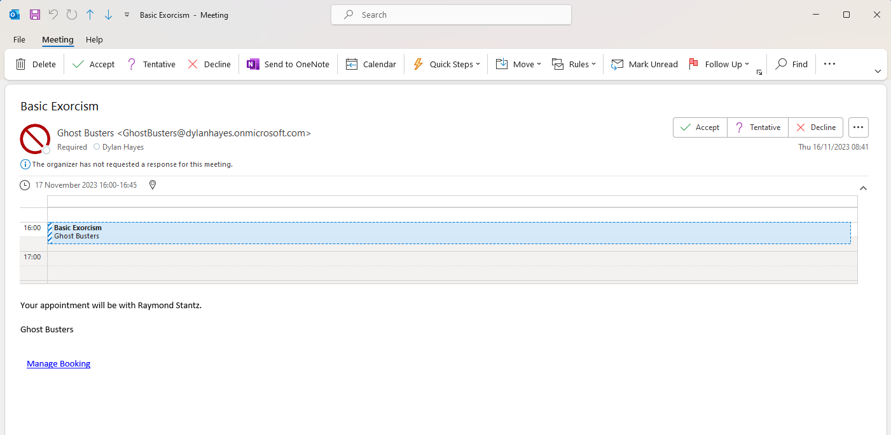
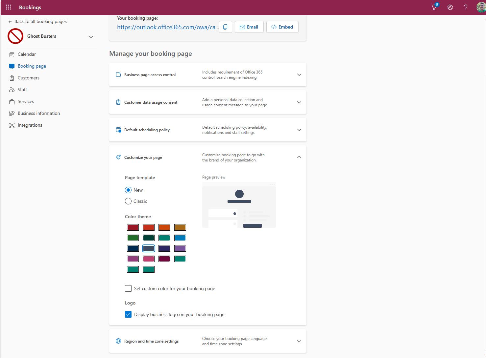
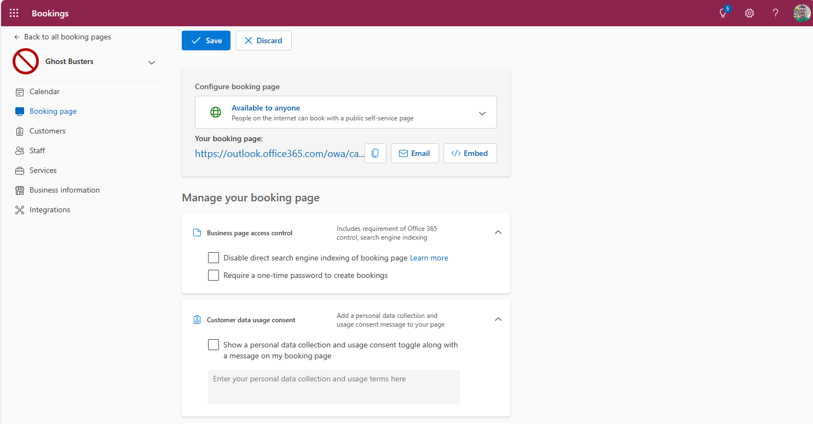

Previously we looked at getting setup with Book Time With Me. Now, we're going deeper and trying some advanced features.

## Advanced Features in Booking ##

I've been using Booking for the over 3 years. When I first got setup with Booking, there wasn't much more to it that creating some service types and getting on with it, but since then a number of new features have been added, which suggests a deeper look might be needed.

### Global setting ###

#### Booking Page Swettings ####

Before we invest too much time, we should get some basic details setup, as these are inherited by any services we create. 

Some of these options are there for addressing very specific use cases, which we'll come to at the end of the section. 

The ones you probably want to tweak first are the Default Scheduling Policy. You may want to tweak the leed time from the default 24 hours, especially if the service you offer requrie travel or preparation time.

You may well want to send a meeting invite as this is defaulted to off. The invitation is basic but ensures customers can use Outlook or other diary management software to manage their own diaries - so I can't understand why this wouldn't be the default.

You can also set some global hours for appointments. For office based staff who work during office hours this makes a lot of sense to tune the available hours for everyone. You can also override this for a specific time period, for example limited or extended hours over a date range. 

Branding is of course really important. Those of your looking for a fully branded experience are going to struggle here, but at least you can set a colour from a default or hex code, and get a logo.

At the bottom of the menu region and timezone settings are available but basic.

There are two menu items for less commonly changed items. The first item in the menu includes the ability to prevent search engine indexing, and the second enforces a one time password to create bookings (I guess both of these limit discoverablity and booking creation to prevent spurious bookings). In my case, I want people to book, so anything that stands in the way is not needed, so the defaults make perfect sense.

Second, you can add a custom data content message, if your own policies or local laws require this.

### Refining your services ###

A good place to go next is the [services menu](https://outlook.office.com/bookings/services) on the booking page. We previously added a single service, but now wer'e going to plumb this up by adding more services, to explore some of the additional options.

to be continued....

