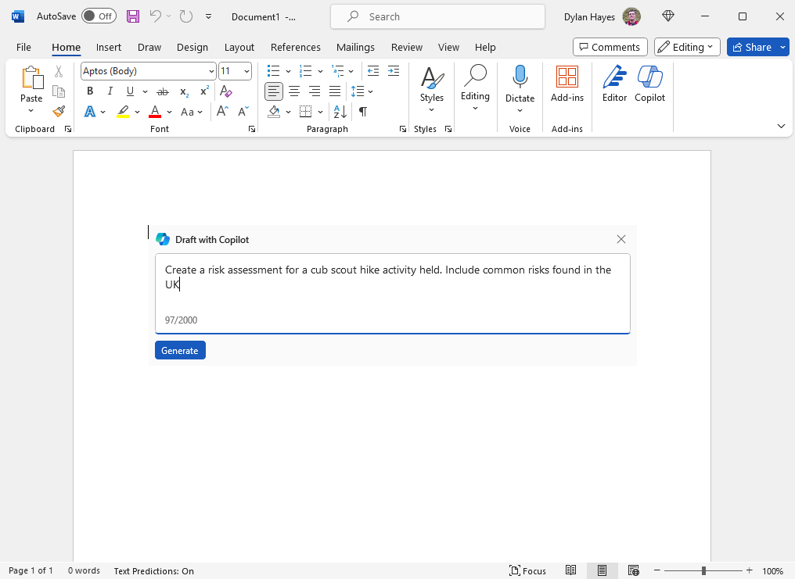
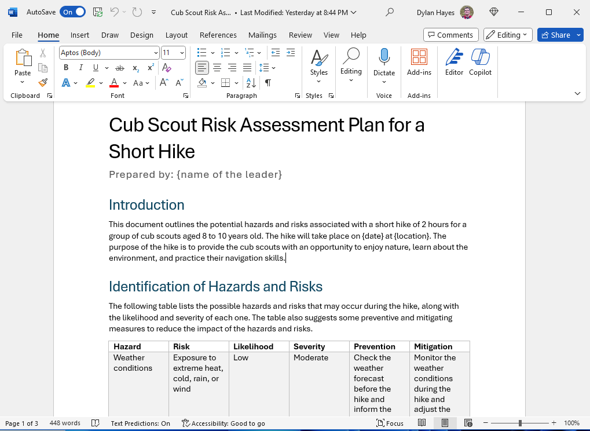
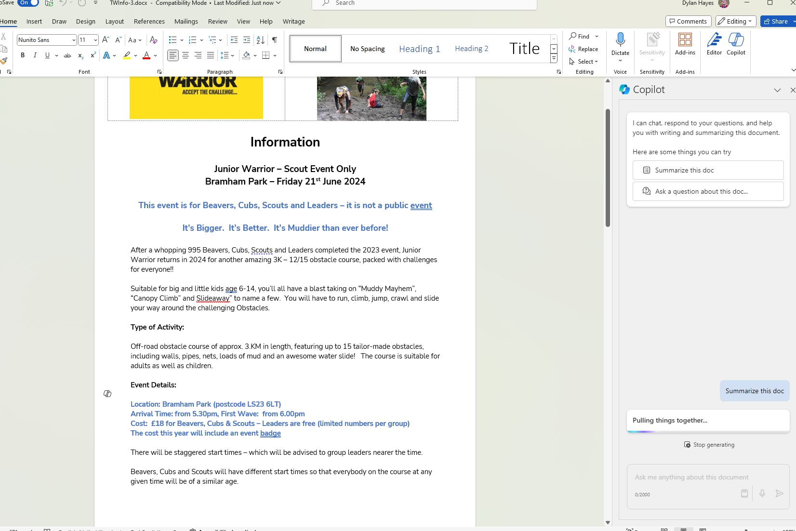
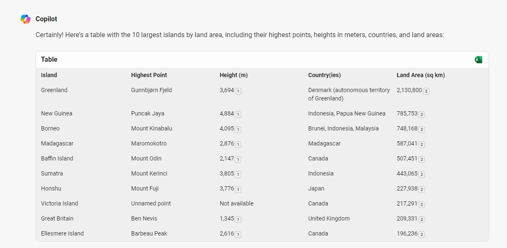
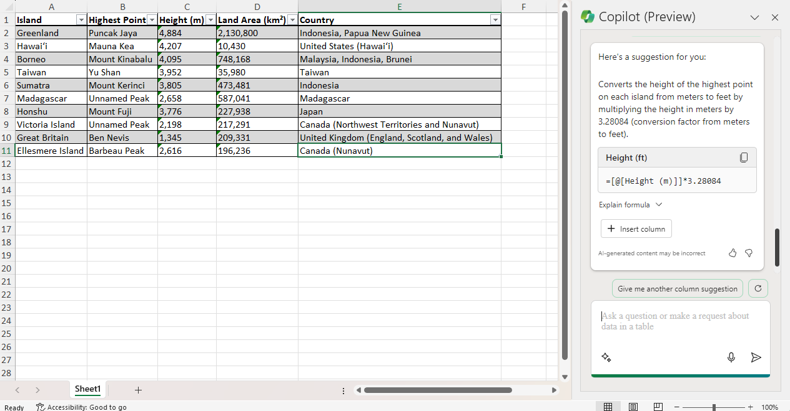
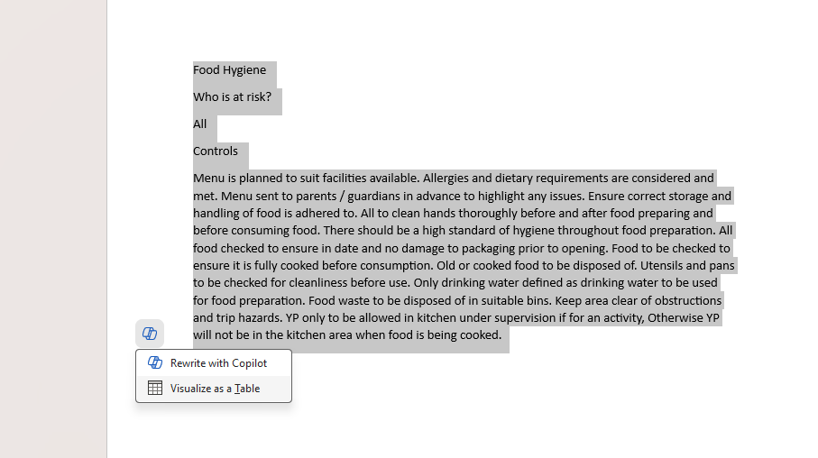
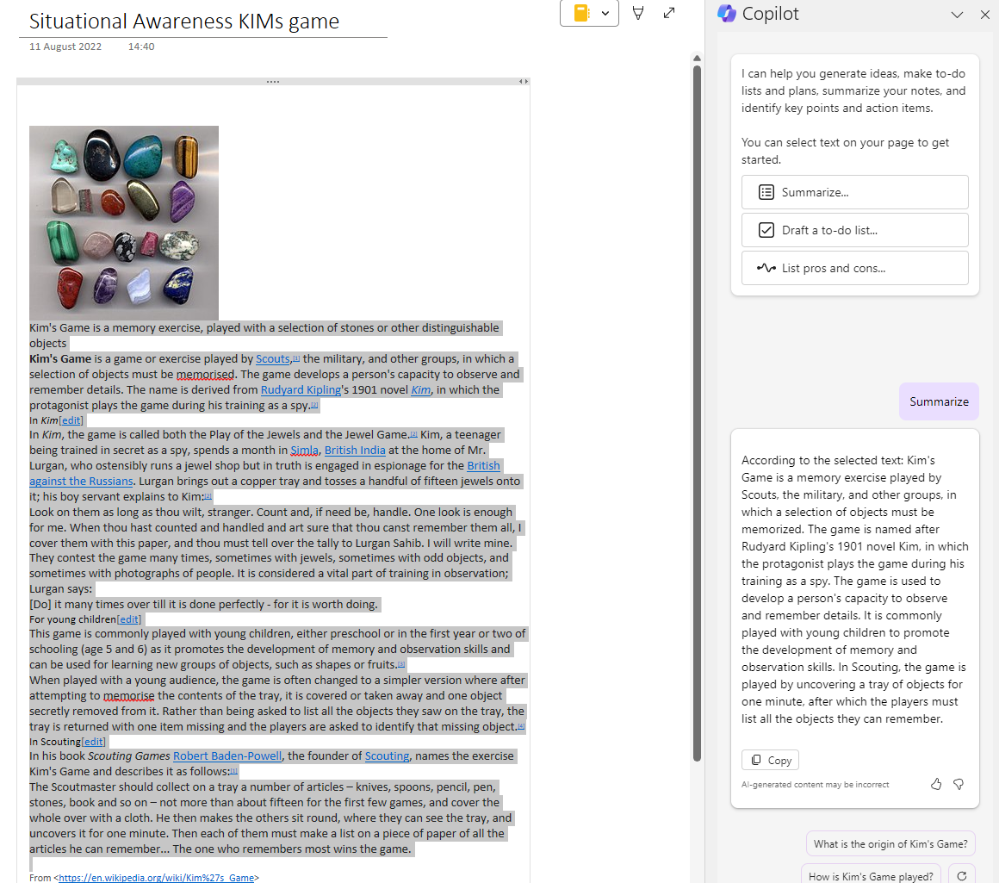
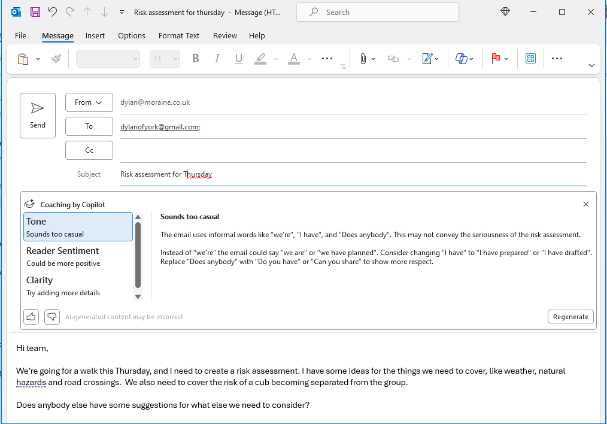

There's a Copilot for everything Microsoft these days. This time, we're going to take a look at how to bring Copilot home.

## A purpose to our adventures in Copilot Pro

When Copilot Pro finally became available on Personal and Family subscriptions, I thought I would try out it. Having used Copilot in what was called it’s Bing Chat incarnation, and Chat GPT Plus, I was keen to find out if Copilot Pro might dethrone ChatGPT Plus as my go to AI tooling. 
To test how it worked, I thought I would try a series of tasks I needed to acomplish in running a cub scout section. Naturally, I use IT and Microsoft services to try and make things easy, and this was the perfect place to see how these two worlds crossed over.

 Before we get down to use cases, I think it’s helpful to explain how Copilot Pro fits into the rest of the Copilot offerings and other Generative AI services.

## Exactly which Copilot are we talking about with Copilot Pro?

Microsoft use Copilot as a label for everything related to generative AI. Although the consistent name, and a strong imagery of a helpful and competent assistant helps to convey what Copilot does, it does get quite complicated to understand specifically which version of Copilot somebody is talking about. In this case, I refer to Copilot Pro, which provides an enhanced Copilot (i.e. the chat experience surfaced in Bing), as well as Copilot features within Microsoft 365 applications. It is this integration that is the standout feature of Copilot Pro.

## How does it differ from other similar Copilots?

Copilot Pro integrates with Microsoft 365 applications as does Copilot for Microsoft 365. Copilot Pro requires a personal or family Microsoft 365 subscription, as it is not a standalone product.

Copilot for Microsoft 365 also integrates with Office applications, and requires a Microsoft 365 license. However, it requires a business rather than personal Microsoft 365 license. Specifically, Microsoft E3 or Microsoft 365 Business Standard and above. As befits a product aimed at businesses, there are a number of additional features not present in Copilot Pro, particularly around governance.

*You can think of Copilot Pro as Copilot for Microsoft 365 “personal edition”.*

To add further Copilots to the mix, there is Copilot (Formerly called Bing Chat), available for free to anybody with a Microsoft account. This lacks all the Office application integration, but has chat based generative AI features similar to the free ChatGPT service.

### Cost

One hard to ignore difference between Copilot Pro and its business focused equivalent is price. Copilot for Microsoft 365 is currently only available on an annual license. At £25 per user per month, that’s quite a commitment. Copilot Pro is £19 per user per month, and it’s charged monthly so you have the chance to see if it’s worth it.

### Unhappy families?

Tolstoy might once have said each unhappy family is unhappy in its own way, but if you have a Microsoft 365 Family subscription, you might find yourself unhappy in the same way. Even through you are bought a family subscription, which can be used by multiple people for the same annual cost, the Copilot pro license is per user, so either one lucky user gets the license, or you will have to pay for each of the family users to have a subscription at £19 per month. The yearly cost of each family member’s Copilot Pro will vastly exceed the cost of the Microsoft 365 Family subscription of around £80 per year.

Copilot Pro is priced about the same as Chat GPT Plus, so if you are shopping for generative AI, and you already have a Microsoft 365 subscription, there is no significant price  difference between the two.

## Comparison with Chat GPT Pro

On the face of it, Copilot is the clear winner. You get access to GPT-4 models as with ChatGPT Plus, and access to GPT-4 Turbo which is more recent and fully featured than GPT-4.

There are of course a number of differences between each. Both have plugins and extension points, which extend the possibilities. ChatGPT has a more mature landscape of 3rd party extensions.

ChatGPT has had the ability to upload documents and use these to contextualise answers. This invaluable feature hasn’t made it to Copilot Pro yet.

Copilot Pro (just like regular Copilot) has the ability to create Excel documents as an output. If you need to create tables of data derived from multiple sources this is an amazing thing to behold.

The most standout feature in comparison with ChatGPT Plus is of course the ability to harness generative AI from within Office applications, specifically Word, PowerPoint, Excel, Outlook and OneNote. As befits a personal product, there no support for Teams and Loop.

# Your second Generative AI “wow” moment

## PowerPoint

The first time you hit the Copilot button in PowerPoint, write up a prompt and see the results will be the same sort of **WOW!** moment you got when you saw the results of your first ChatGPT prompt. In my case, I needed to create a PowerPoint to explain the Lunar New Year to Cub Scouts. A simple bit of prompting produced a decent PowerPoint that featured vibrant colours, suitable images and the text I needed to introduce the concept of the lunar new year and the zodiac animals, and the significance of the Year of the Dragon. I would have taken a while to do that in my previous workflow of ChatGPT, DALL-E images and then pasting it all into PowerPoint and trying a few designs.

The same functionality of prompt based content generation is repeated across the other Office applications.

## Word

Each time you hit newline, the Copilot icon appears in the left margin. Hitting the Copilot button, brings up a prompt. Create the prompt, and your new text is regurgitated. You can provide further prompts to rephrase the text. The ease of changing the prompt and not having to paste the text from a web browser into Word makes this a real time saver. You can also select some text and have it rewritten and easily flip between different versions. Again, this is a significant time saving. One feature that is not there is to be able to shape the rewrite with further prompts. One really interesting feature was the ability to select text and visualise the text as a table. Copilot seems to do a good job of extracting the useful parts into a meaningful Word table. As tables are always a pain to edit this saves frustration and time.

I was able to use these features to create and refine a risk assessment for an event, based on fragments of text from old risk assessments, and new risk assessments created from prompts. Whilst still needing some careful thought, and fact checking this was clearly less work than starting with a blank sheet of paper.

My previous workflow involved the creation of content in ChatGPT, and pasting it into Word. This involved either a 3rd party markdown plugin such as Writeage, or pasting as plain text and adding the markup, as Word would convert ChatGPT derived content as tables, which are not a good way to manage text in Word.

Another use case is the ability to create a summary. In this case, I had an email about a scouting event that I wished to condence down the details and remove irrelevant sections and send it to parents. A few clicks got me a summary, which was ready with a few edits for an email. The alternative of snipping bits from a Word document and cleaning formatting would have been 10 minutes of tedious work.

## Excel

After all the Wows, the Copilot support in Excel was more of a ‘hmmm interesting’ for me. Copilot in Excel works on tables – rather than authoring content. If you recall, Copilot can create tables as output, so content creation is available, but requires two steps.

In this case we’re going to create a list of the highest point of the largest islands (just because) with Copilot Pro, and output this to Excel. The ability to coalesce multiple sources of information into one table and make that into Excel is astonishing. But, as ever a keen pair of eyes and subject knowledge still pays dividends, as my first pass through this featured some mistakes when my prompt was too ambitious in trying to merge too many sources. Regardless of this, in a real world case, the ability grab data and make Excel documents is truly useful.

But, once you have the table, you can ask questions about the table. It’s a great way to gain insights into the data quickly. You can also ask for calculations for columns. Although this seems far less striking than the ability to magically create text from thin air, if you work in Excel a lot and don’t mind changing the way you work it’s powerful stuff.

## OneNote

OneNote is my all-time favourite application. I tend to only use written paper notes as a temporary cache to capture things during a call before I can write them up in OneNote. As a consequence, I have a lot of OneNote content, and sometimes the content is copied and pasted from somewhere else, and more sometimes it’s a Joycean stream of consciousness that anybody else would struggle to understand. If I need to use OneNote as the basis for writing something based on this, it’s a bit of a chore turn it into useful prose, or extract a summary.

Copilot does a great job of cleaning up some text that suffers bloat and poor writing.

If you need to distill the imformation you can as well.

By selecting text, and telling Copilot to create a summary you get a nice clean bit of text. It does a pretty good job of removing formatting that might have come from copying from a webpage, and generally cleaning up the output. You can even ask questions about the text to save yourself the effort of reading every word.

## Outlook

Lastly, let’s take a look at Outlook. There are some caveats to Outlook support. For starters, it’s only going to work with a Microsoft account. Which is a big limitation when home users will have whole stack of different email providers.

There is the ability to summarize an email chain, which works pretty well, although as always, summarisation may miss the subtle details which may matter, and there is there is as you would expect the ability to draft an email from a prompt, as well as reply with Copilot.

The bit I found interesting is the email coaching, where it will examine an email and make suggested improvements. Being misunderstood in email, either factually or in tone is common, and often the cause of problems later on. Having a second pair of eyes review an email, even if you don’t follow the recommendations fully is potentially valuable if you are worried about how an email will be read.

## Moving on

OneDrive is not yet supported, but coming to the Copilot for Microsoft 365, so one would assume OneDrive will get the same treatment.
