Copilot Pages are a feature of Biz Chat allowing a more interactive approach to AI assisted authoring. Although broadly similar to Canvas in Chat GPT-4o, Copilot Pages have some interesting features for mixing different types content due the incorporation of Loop capabilities.

## Starting with a prompt ##

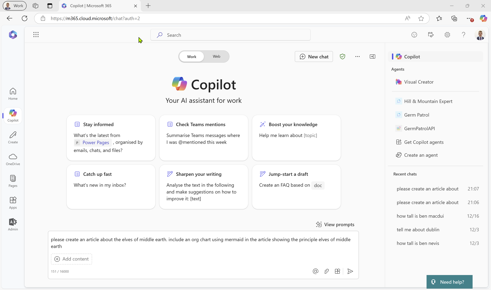

```
please create an article about the elves of middle earth. include an org chart using mermaid in the article showing the principle elves of middle earth
```

## Looking at the output ##

The output of our prompt is displayed as the results.  As expected, an AI generated article has been output - so far so expected.

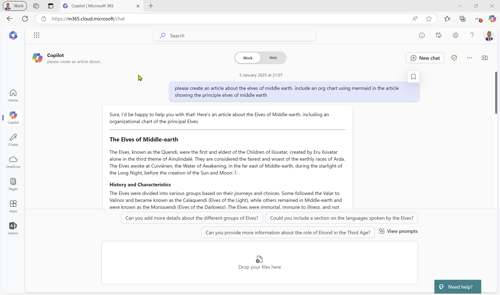


## Chart ##

If we scroll down, we can see some markdown has been inserted into the text. It took me a few interations to get the right prompt, as my first few attempts ended up with a designer image of mermaids, and charts. Eventually, I got chat to create output in Markdown, with additional instructions in Markdown to render a chart in Mermaid. There are lots of tools which can render Mermaid, and plugins for ChatGPT, but here we're going to keep this all "inhouse" and display the chart inline in our output.


## Edit in Pages ##

If we scroll to the bottom of the output, we can see "Edit in Pages". If we hit this button, the magic happens. If we scroll down we can see that the chart is now rendered from the Markdown. We can select if the chart renders as source code, a chart or both. 


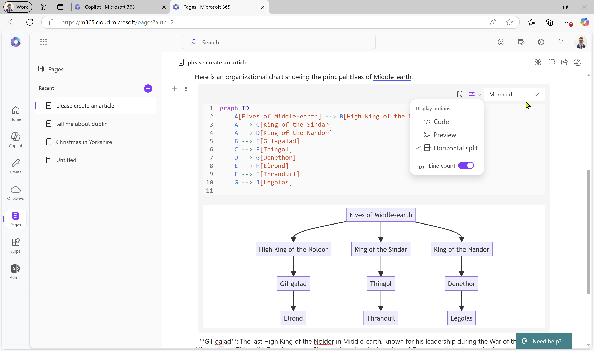

We can keep editing in chat, and inject additional prompts to change the text. 


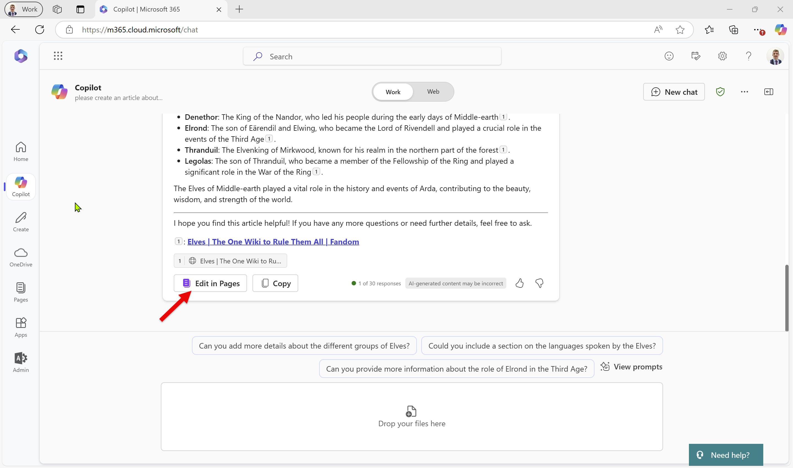

## Rich Content ##

Mermaid charts are just an option to format code. We also have other formatting that you'd expect in things like a Word Docoument, like tables and lists:

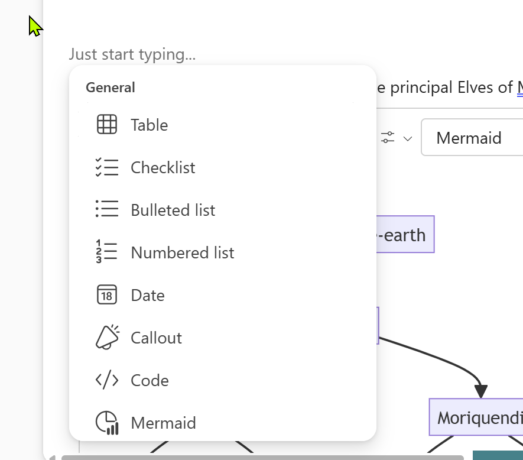


## Add finese ##

 My previous AI workflows tended towards using AI to make a first pass at a document (the so called "death of the blank page"), and then editing the document to the final version by hand. Instead, here we're now going to spend some time coworking with Copilot, where I refine the document through direct edits, markup, and reformatting with new prompts.

Our first job is to move text around and add some semantic meaning. 

First, let's get a proper section heading in there:

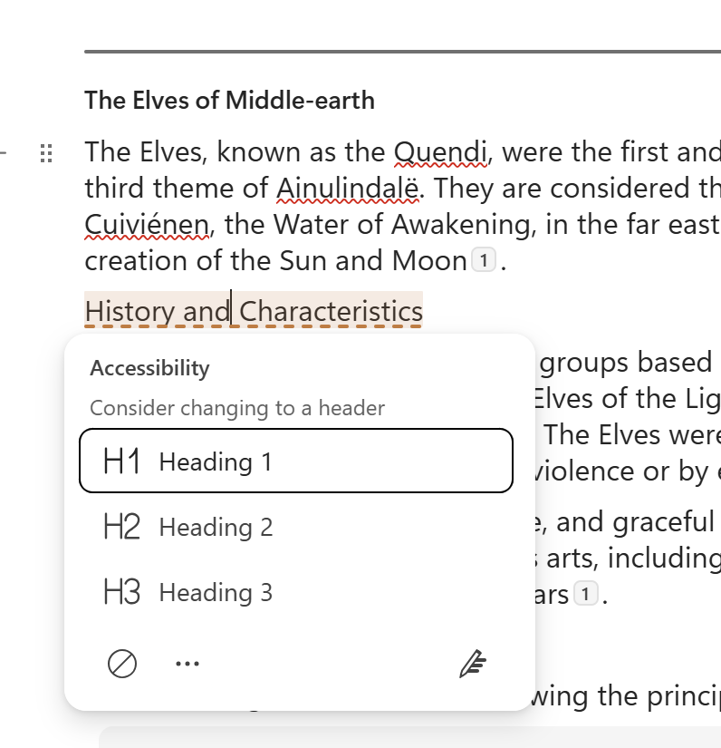

If you want to move a paragraph around you can change the ordering without having to cut and paste.

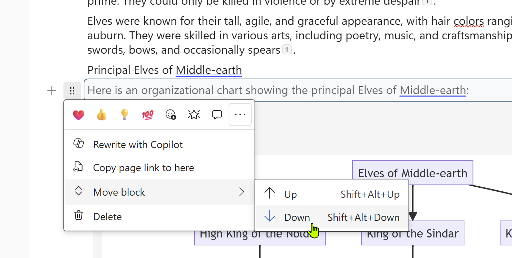

It's looking better with our edits, but on reading it (you do read the AI output properly right?), we decide we want to mention why the elves left Middle Earth.

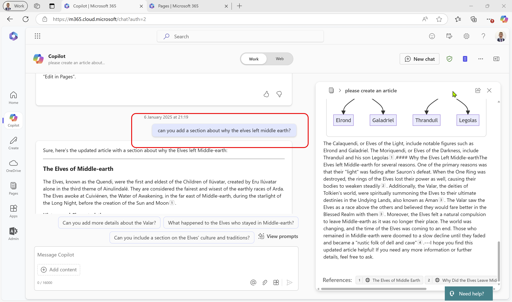

The new text is rendering below. This is a bit different to how ChatGPT canvas works, where the prompt changes the text on the right directly. If I scroll to the bottom of the newly created text, I can simply hit edit in pages, and my changes are appended to the text on the right. I found this feature not as intuitive as ChatGPT's Canvas. Addmittedly, Canvas gets a bit flakey when editing and the manual edits can go sour and lose formatting, but appending the edits on the end, and leaving the human to edit the text on the right isn't great.  

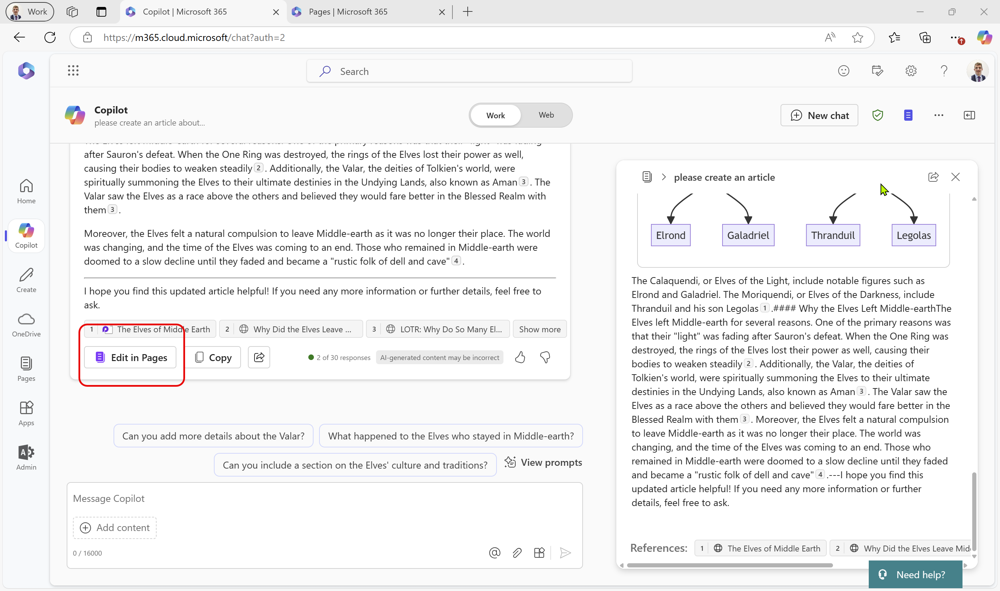

## Opening in Loop ##

If we are done with the AI led authoring experience, we can hit the small "page" icon to open this in Loop:


 We now have the same editing tools, to format our text, with more screen real estate given over to the editing expeience, but now we're in Loop we've lost the ability to keep changing the document from the prompt. 

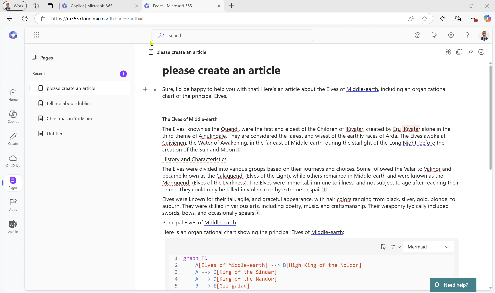


To get this closer to something we're ready to publish, we're going to keep editing. For starters, let's change the title to something more meaningful, by clicking on the title and editing the title inherited from the prompt.

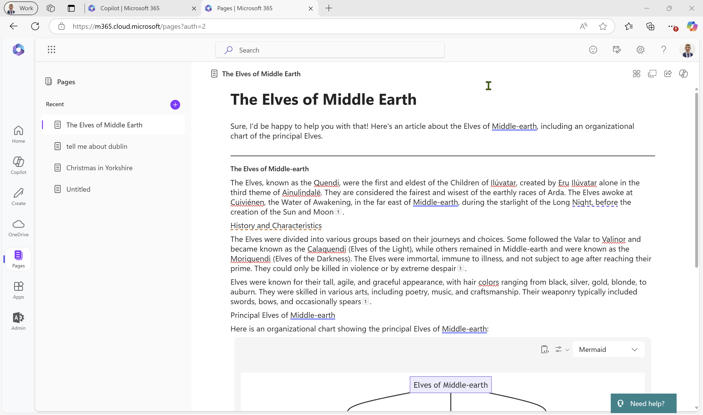


We still have the ability to select text, and get Copilot to rewrite a section, but this isn't the same AI driven editing experience we just left behind.  

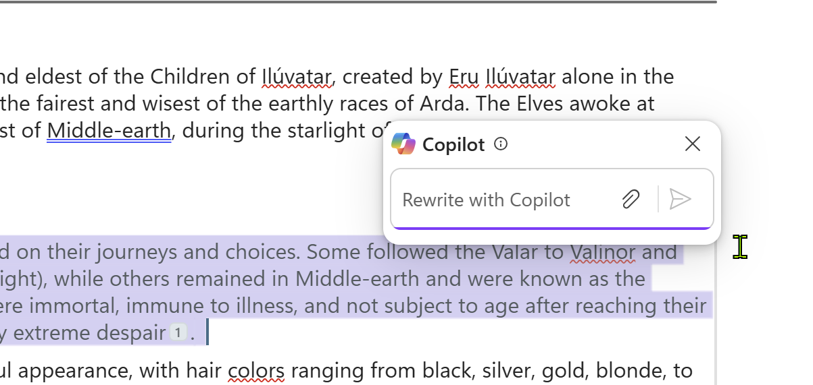


My feeling is this is for smaller tweaks to a document you are mostly done with serious large scale editing, and may just need to tweak and revise the last little bit. 

 The capabilities of Loop are worth a separate post, so I'll not go into any more detail at this point..


