Metadata is virtuous, but like many virtues easily ignored. The problem is most people can't be bothered to enter the data that makes life easier. Arguably search and increasingly generative AI means metadata is less important, when searching for keywords keeps getting better - but try sorting and filtering on document contents and you'll soon see why structured metadata is important.

## Getting setup ##

Autofill columns have a running cost, just like Syntex. You are going to need to turn these one before you can use them.
You will need to have billing setup, and enable Autofill (you may also want to add Syntext later)
In Microsoft Admin Centre, go to Billing and enable Autofill and Syntex.

## Baby steps ##

Just like regular columns, your first choice is to figure out what the column should contain and what data type best represents this. An autofill column is just like any other column, and ideally should belong to content type to promote consistancy and reuse. Do note however - although you can and indeed should create columns used with autofill as site columns in the content type gallery so they can be shared, the autofill settings are set locally in each document library (which makes sense as they should be tuned to each use case), so you'll need to add the autofill settings each time that they are used.

In this example, we're going to be extracting different fields from a PDF utility bill. In this instance the document has a text layer, which gives the AI something to work with. If you have a scanned document with no text, you are going to need to do some OCR extraction first. 

It's worth remembering that autofill is pretty smart, and you don't need to train it for each document you use it with, but you really should test this with each document the autofill column is likely to see - as the autofill will try the best it can, and the results may be unpredicable. In my experience it works really well when processing the same document (like a ulitity bill from the same provider), but results may vary with something as varied as invoices, with have different layouts and terminology for the different parts. If you have this sort of scenario, you may well be needing the capabilities of Syntex, which offers prebuilt models for invoices, as well as the ability to have custom models which can categorize and extract from documents, allowing you to tune models for each document type.

Our first column is the account number. Despite the title being account "number", the number might actually be a string - so we're going to use a text field here. Let gett his added this now.

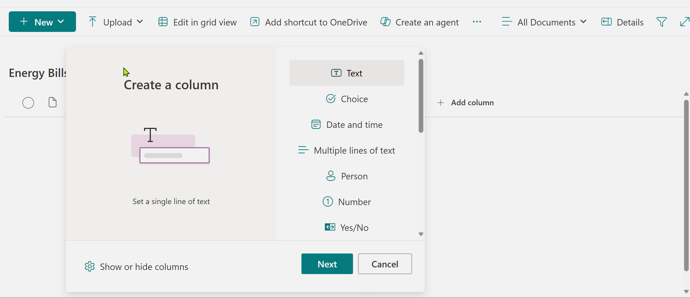

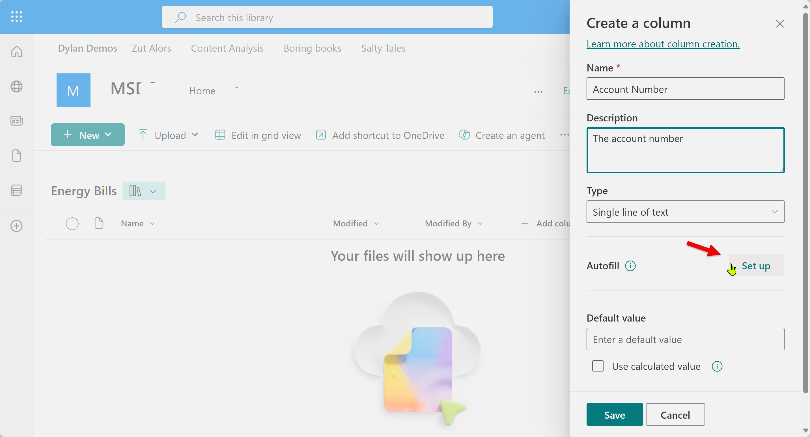

Then we hit Autofill settings. 

We'll add a prompt to tell autofill to extract the account number.

A tip here is to add some example data first. If the library is blank you'll need to write the prompt yourself. If the library is populated, the process is easier - which we'll come to in a bit.

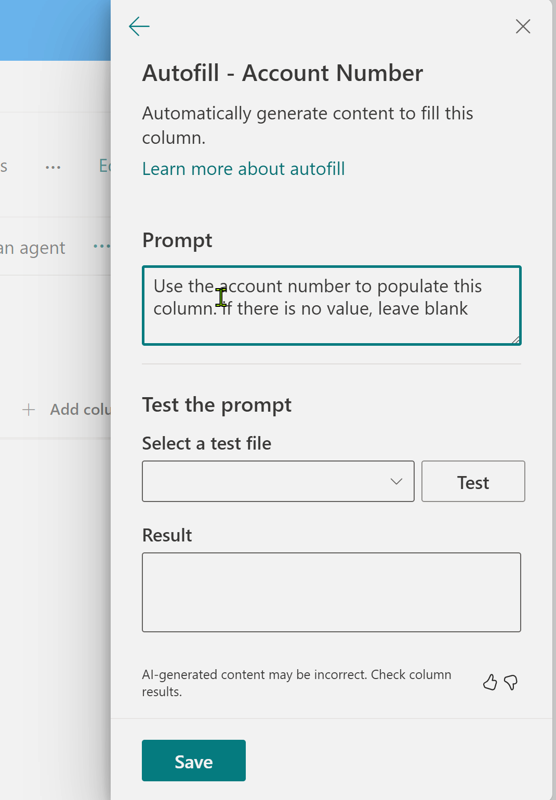

Then, we can hit save on the prompt we've just created.

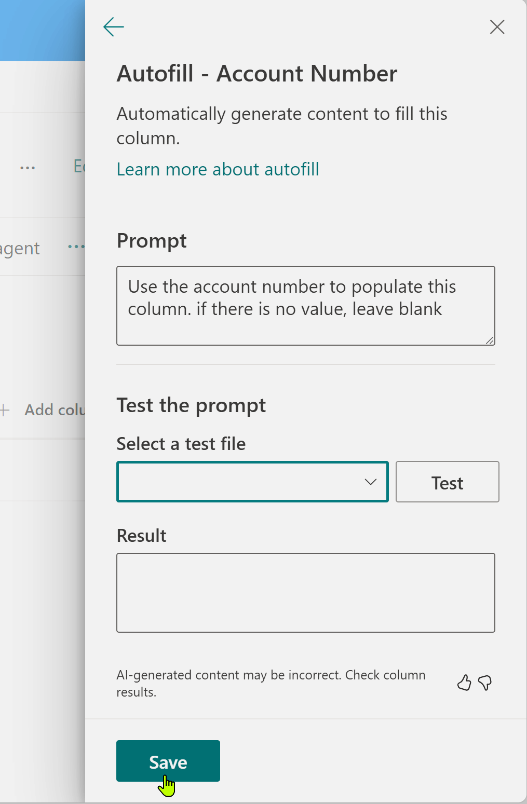

As you can see next, we have some autofill settings added to the column, so we save the column and see what happens.

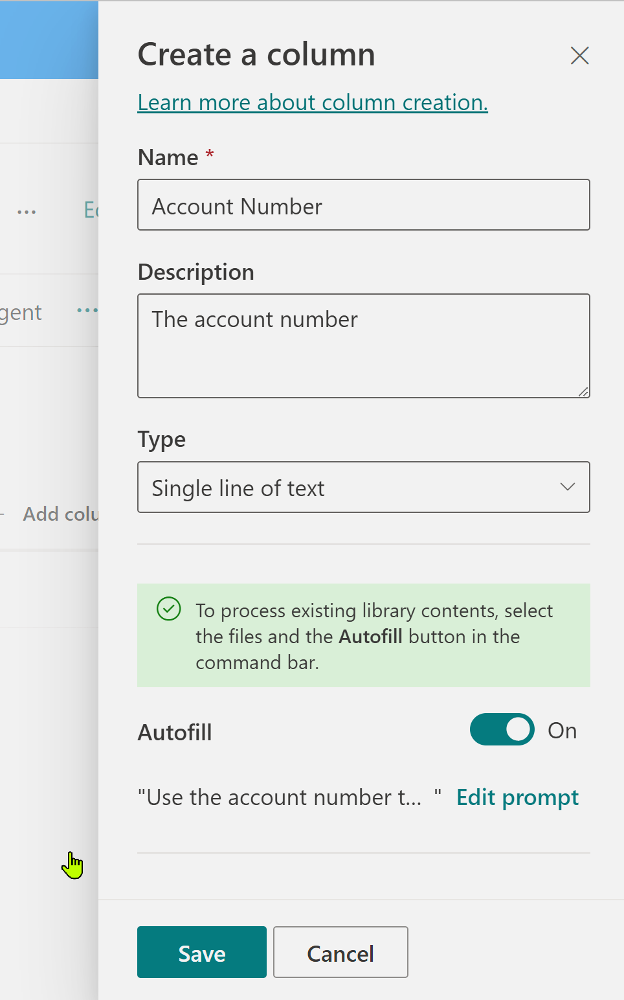

Now, we're going to add a utility bill, and set it to work. Let's right click on the fill and select "Autofill".

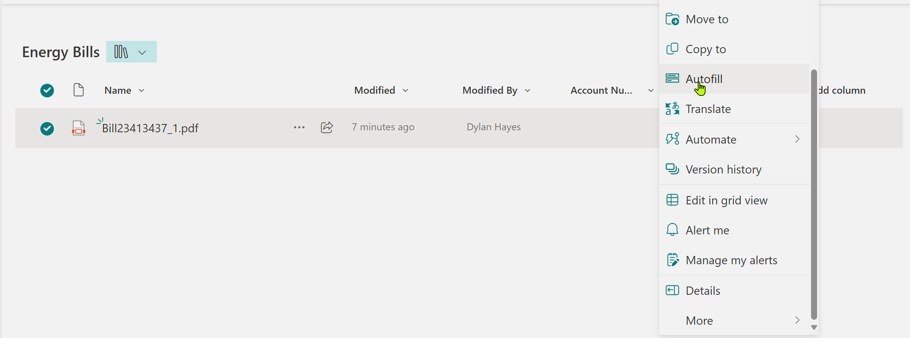

There's a message that this may take a while. But fear not, it's usually less than a few minutes.

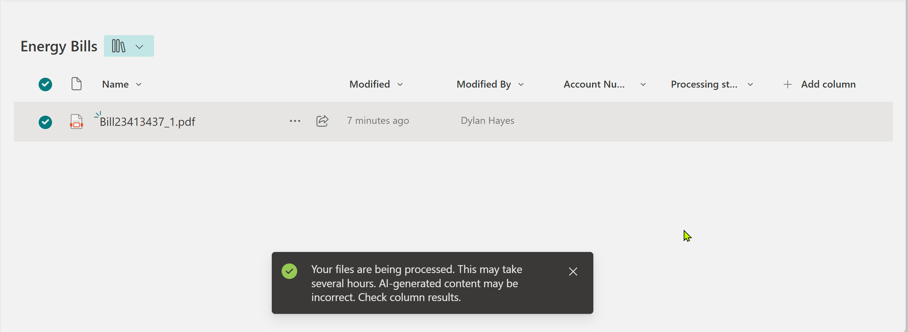

And hey presto - the value is populated.

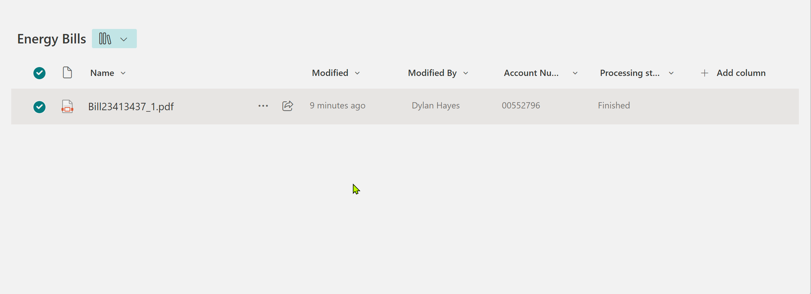

## Going Further ##

Next we're going to extract the bill data. On our bill, this is called "Created On". Let's add this as a date column.

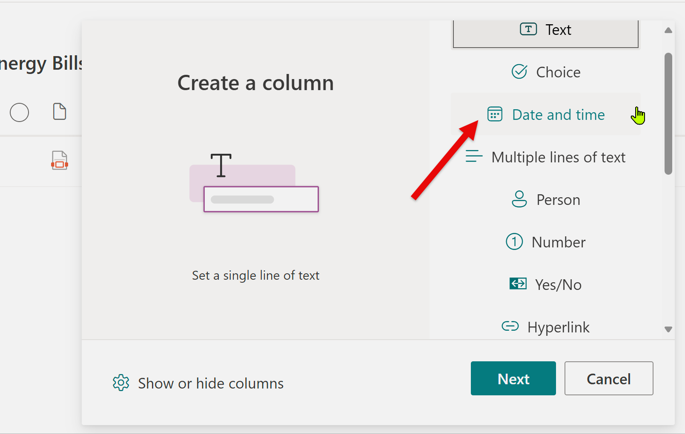
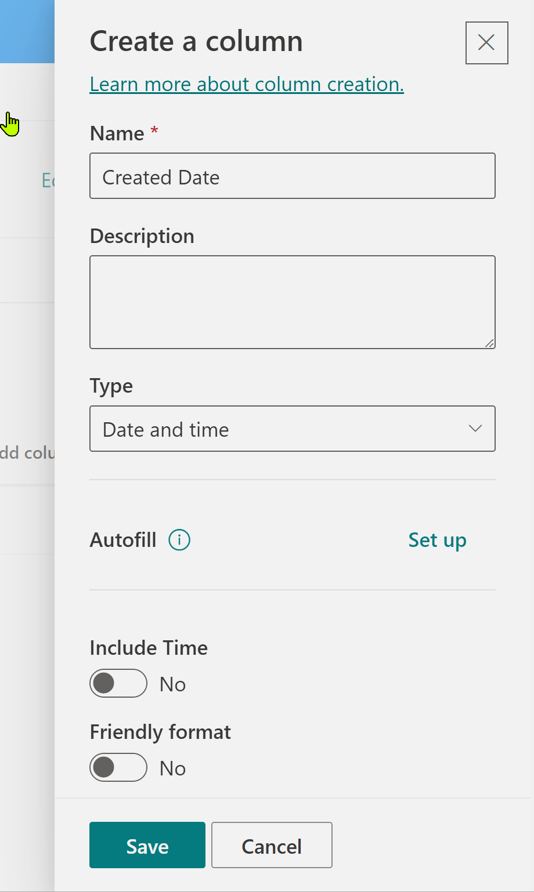

Now, here's where the magic starts. As wer're already named the column as Created Date, and given it the right data type, a default prompt has been created for us. Simply clicking on the automatic prompt suggestion will fill in the prompt for us. In general the automatic suggestion gets it right - so let's go with that.

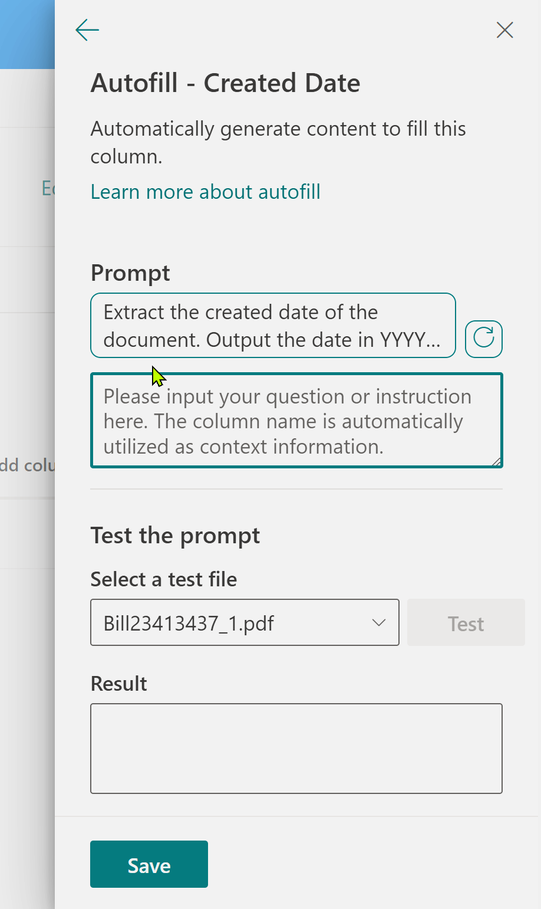

There's also a "test" button - which if we click on it allows us to test the prompt extracts information. You can choose which file to test on so that you can try a few samples and tune the prompt if needed.

Once again, we can save the autofill, save the newly created column, and test it works. Be warned, each run is Syntext consumption and billable (although it's fractions of a penny each time).

And that's pretty much it to get started.

## Complex Use Cases ##

Our next post will look at how we can work with more complex data. Mapping arbitary dates and numbers from a document is easy, but chocie fields and more complex data types require a little more effort in the prompting.