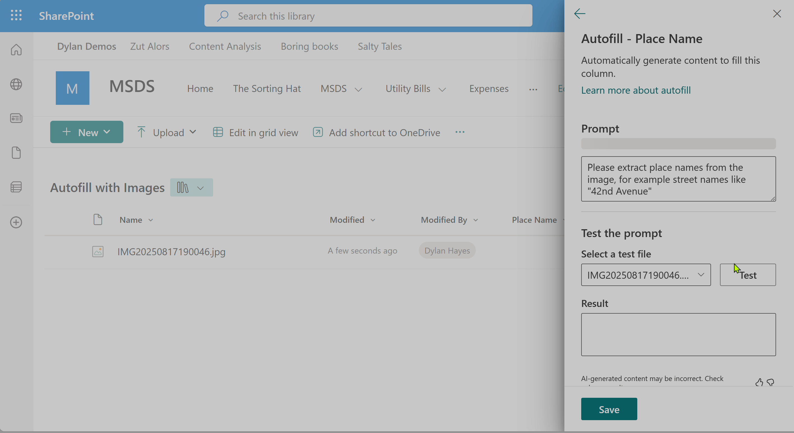
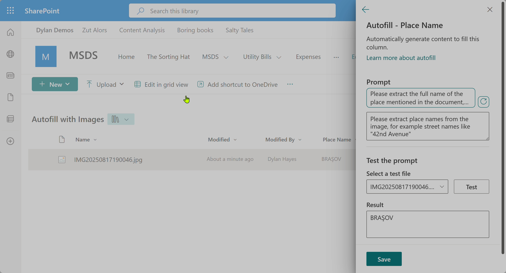

We've [previously looked](2025-06-07-In-Praise-Of-Autofill.md) at how Autofill columns can do really useful things really easily. Now we're going to look at some extra features you might not have considered.

## Images ##

It turns out that Autofill can work with images. Unfortately, this doesn't mean Autofill can (yet) understand an image, but it can read the contents of any text in images. This opens up the possibility of understanding structured text in scanned documents which haven't been OCRed, as well as extracting text from photos. 
Let's look at an example.   

First we create a new autofill column, and add a prompt to extract text. As we're trying to extract any placenames we find, we can keep our prompt pretty vague. If we were looking for something more structured, we would use a prompt more like what we did in our first example.

And now let's test it with an image we've uploaded already:

Here's the image we have extracted it from showing a Hollywood style sign above the town of Brasov in Romainia. There's obviously bit more going on that simple OCR, as the eagle eyed will notice the sign is in capital letters and says BRASOV without the accent on the S, but the extracted text says BRAŞOV.

