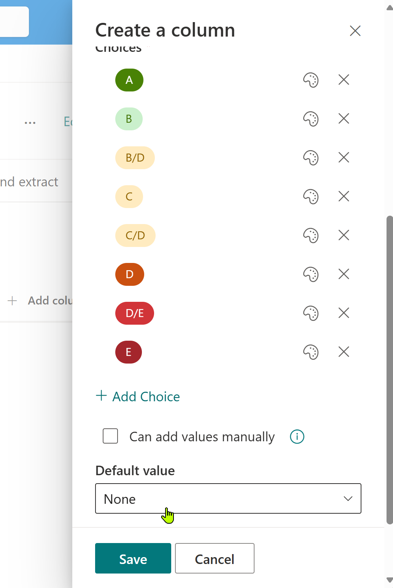
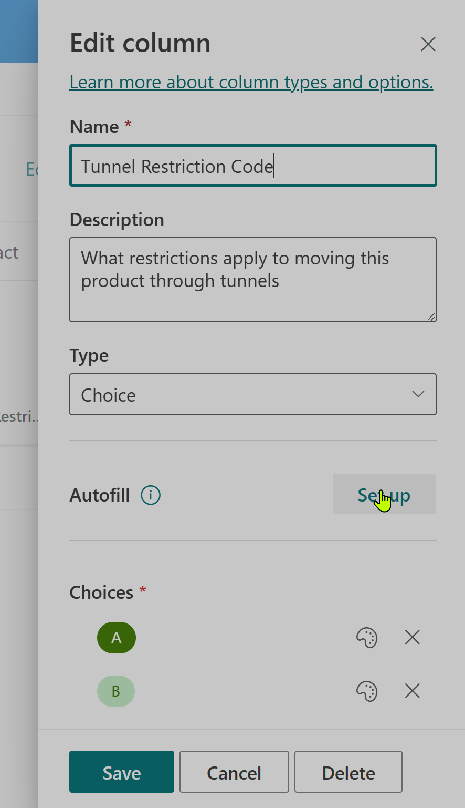
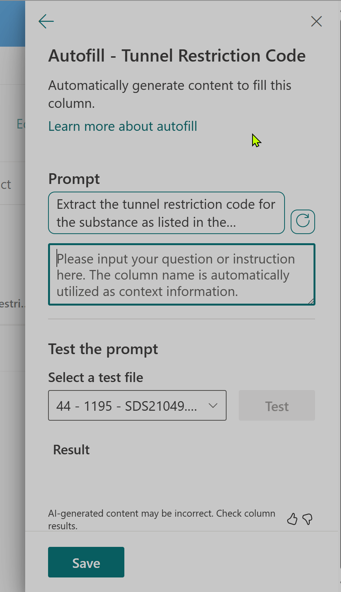
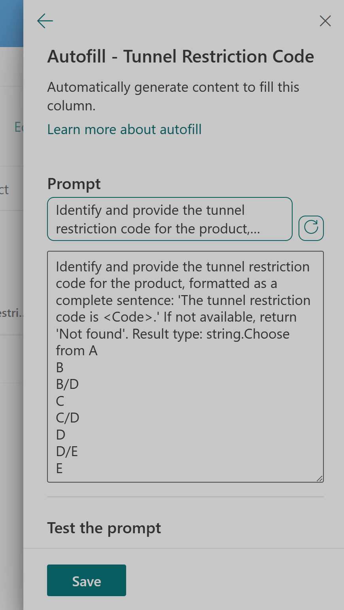
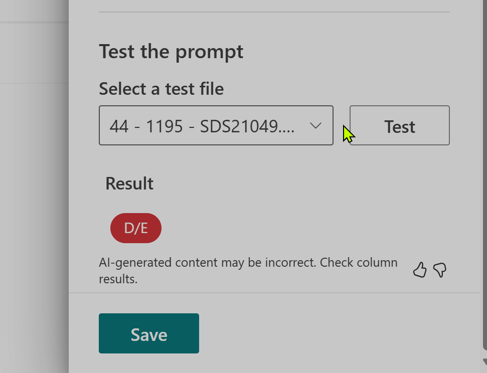
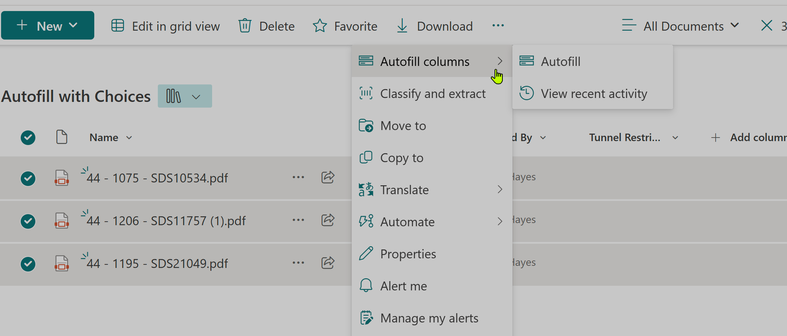
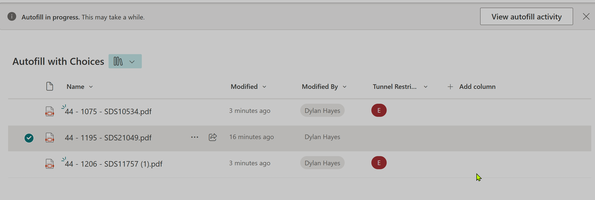
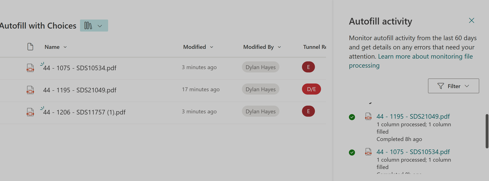

We've [been looking at autofill](2025-06-07-In-Praise-Of-Autofill.md) and how easy it is to do useful things.  We've seen how that works for text fields, and it's not hard to see how this would also apply to other types of fields like numbers and dates. 

The next part of our blog post is about choice columns. Text is all very well, but if you are minded to put a chaotic universe into neat categories, then the choice field is the obvious choice.

First we're going to create the choice column. Choice fields work best when the contents are always from a small catalogue of items which don't change often. For this example, we are going to be looking at Material Safety Datasheets (MSDS), and something called the Tunnel Restriction Code. Some chemicals are really hazardous, and require restrictions when passing through road and rail tunnels.  The tunnel restriction code is an EU defined letter from A to E, with 'A' being fine, and 'E' being scary stuff that needs to be taken seriously.  There's a couple of variations where something has a code made of two letters like C/D, but all the possible choices are well defined - as you would expect fpr  something authored by a regulatory superpower.

First let's setup the choice field. We'll add some colour coding to hint at the relative restrictions through colours- with red for danger. This is something we couldn't easily do with a text field, as we're now applying some semantic meaning to the data not just storing text.

If you remember from our first example, it's easier to create the autofill if you have some test data, so we're going to drop a text file into the library now.

Now, let's add the autofill.

Because magic, and that we've created a choice field populated correctly, autofill has autofilled a suggestion for the prompt. 

Let's go with the suggestion, and let autofill autofill the prompt.

Now let's hit test and see how it goes.

The test works. Let's try and scale that out to try a few more. First we'll save the column, and then let's drop some more files in the library. We can just wait a bit, and autofill will kick in, or we can select them and then select 'autofill' to repopulate the column (for instance if you change the autofill promopt).

It looks like we're got 2 the two we added to process correctly. But, the item we had added first hasn't processed, as it was added before the automfill was setup (autofill will automatically process new items automatically). However, if we select autofill from the menu on the item we can reprocess this item, and we got 3 out of 3. Nice work autofill!

Lastly, let's look at the fairly new feature which let's you see what autofill has been up to. If we hit the show autofill activity, or select it via the menu:

We can see a nice log of what has happened. There does seem to be a big here, as the column has only only been created just now, but the log shows the autofill activity happened 8 hours ago.

So that shows a few of the different way we can use autofill. It's worth bearing in mind that autofill does have a running cost per action, but it's probably less than the cost of getting a human to add the metadata by hand, and hopefully less than the opportunity cost of not having good metadata. A further advantage worth remembering is that autofill is OCR capable, without the additional complexity of hooking into OCR services like Azure Cognitive Services. 

If your needs are more complex that this, you may soon outgrow autofill. Syntex, which is part of SharePoint Premium is probably something to consider. We'll take a look at this in a future series of blog postings. 
