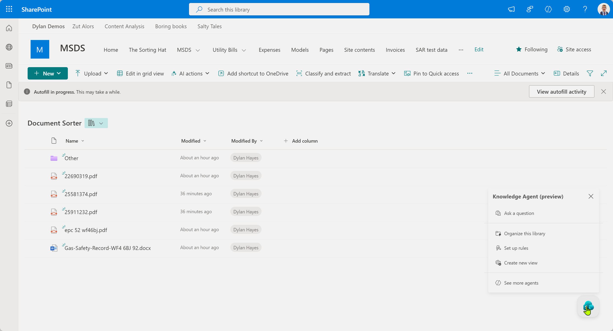
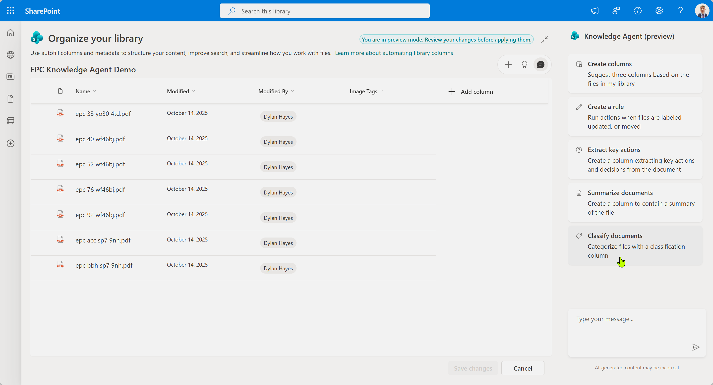
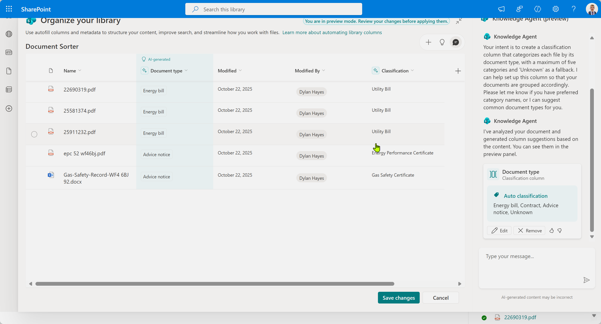
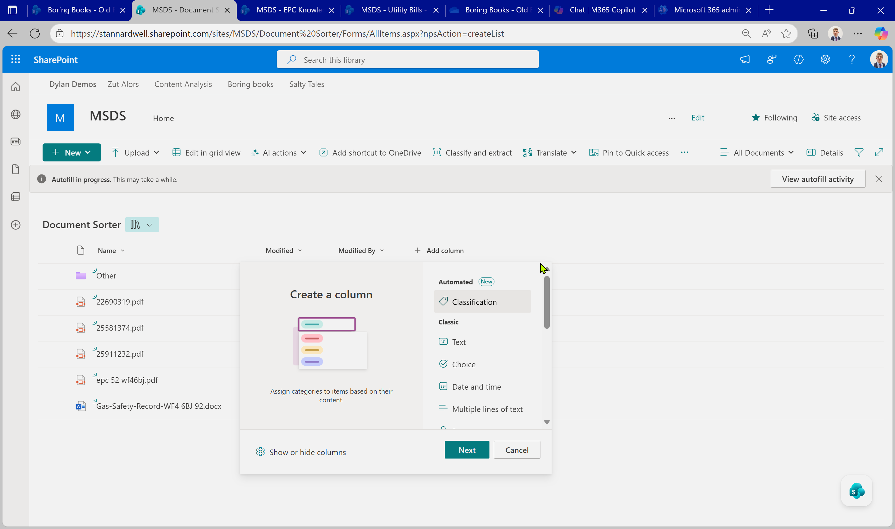
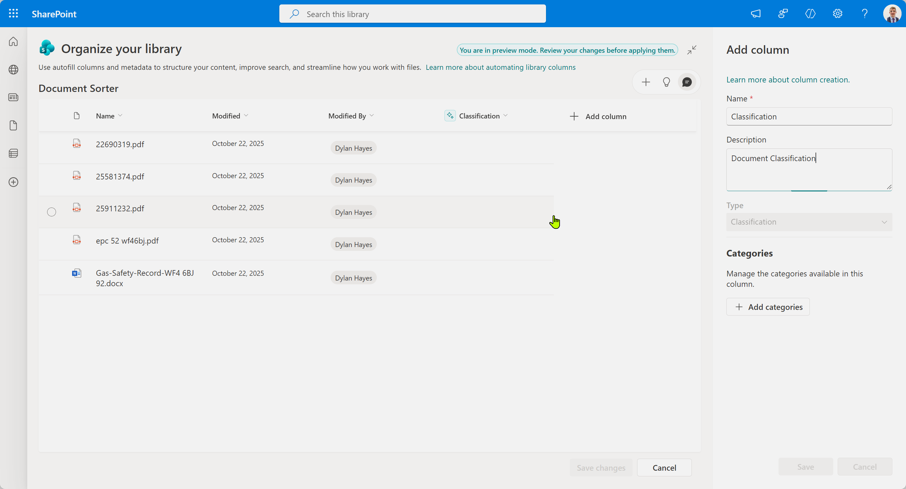
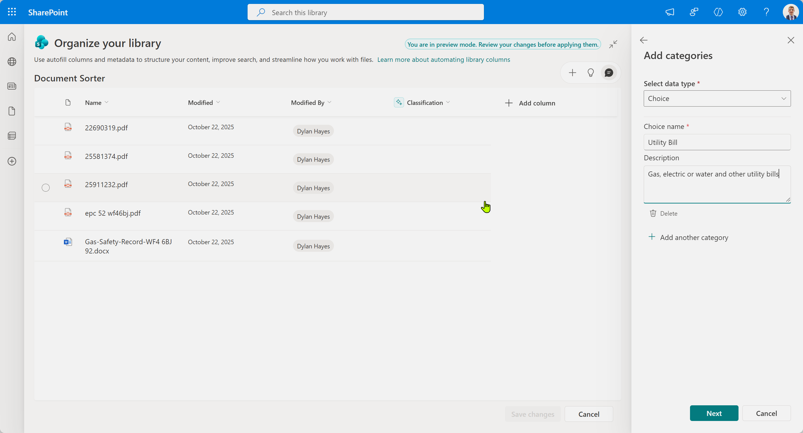
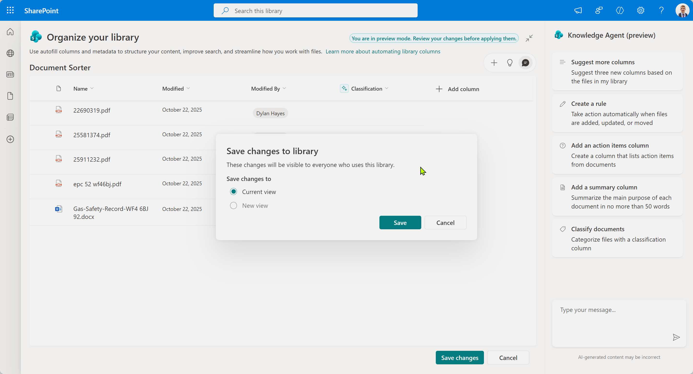
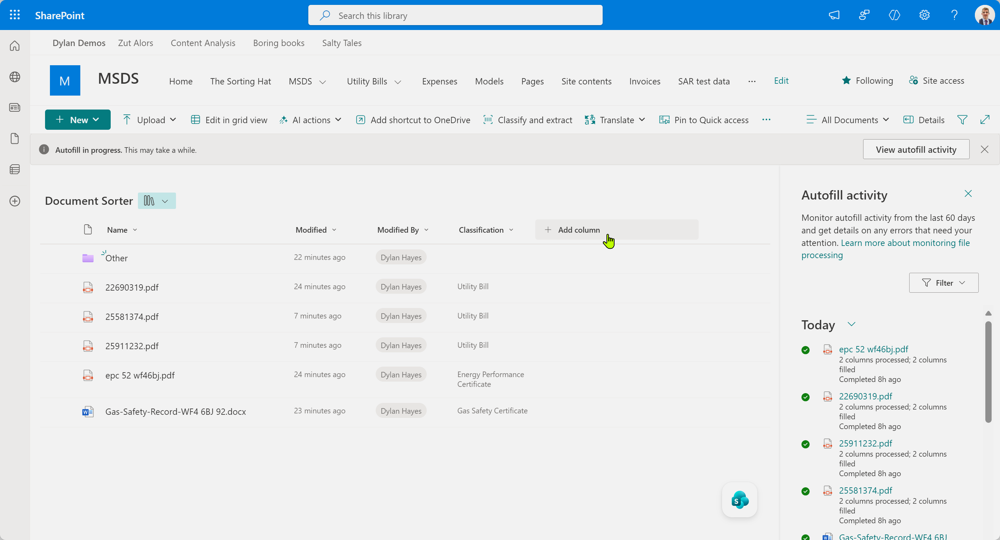
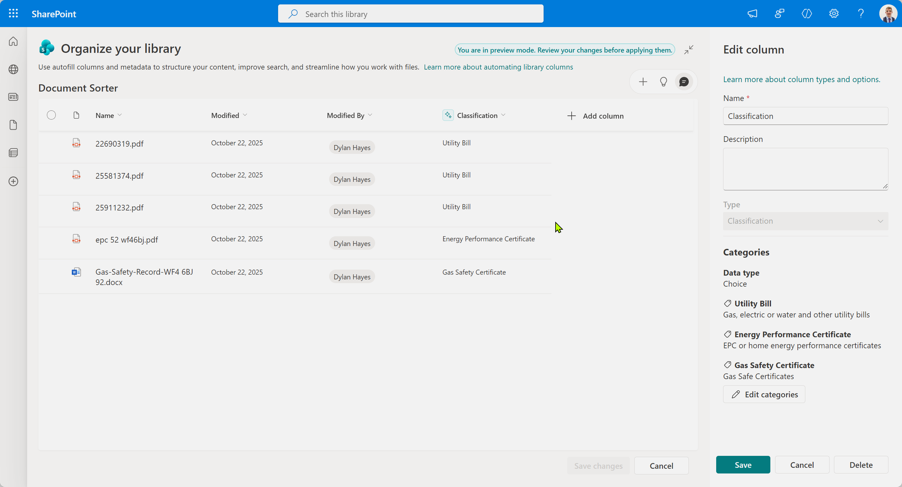

Previously we've [been looking at autofill](2025-06-07-In-Praise-Of-Autofill.md). It's useful, but there's more that can be done with classification. Classification is a useful first step in dealing with documents - as by knowing what something is, you know what must be done.

## Prerequisites ##

As of late October 2025, SharePoint now features the SharePoint Knowledge Agent in preview. This requires PowerShell to enable (this will change), and Microsoft 365 Copilot. Additionally you will need to have enabled Autofill columns - which requires turning on in admin centre.

First we're going to do this the easy way using the SharePoint Knowledge Agent.

## Cheat Mode On ##

You can go straight to the SharePoint Knowledge Agent, and select 'Organize this library' then select the prepared prompt for 'classifiy documents', and run the prompt. This will create a classification column, which can also be done manually - but with the AI creating the classification choices. This works reasonably well if you have good examples in the library already. For fine grained control, especially if you want to apply further processes depending on the type (for example rules in the SharePoint Knowledge Agent) you will probably want to define the choices yourself.

First, open the SharePoint Knowledge Agent:

Then classify documents:

First pass looks ok:

## Manual Override ##

We can do the same thing as the Knowledge Agent - but we can exert a little bit more control over the process.

### Step by step ###

The 'add column' dialog now has 'Classification'. Let's select this:

Provide some details for the new classification column:

Select add category:

Describe our category. Be specific about what this is, and provide a good descripion so that the AI can identify documents from your description.

Save changes - remember unless we do, this will not be saved for this library.

Let autofill get to work. Yes - there's a weird bug with the timing of the autofill actions ('8 hours ago').

Autofill is done. Note the document have got sensible categories as we defined.

We can edit the column and review the choices to fine tune the behavior.

## Summing up ##

The SharePoint Knowledge Agent is a great tool for getting a start on classification. If you want fine grained control over the actual choices you may need to edit the chocies yourself - taking care to describe each one well.