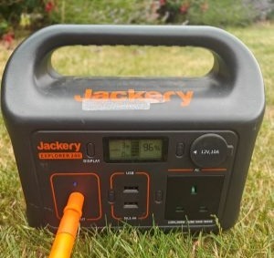
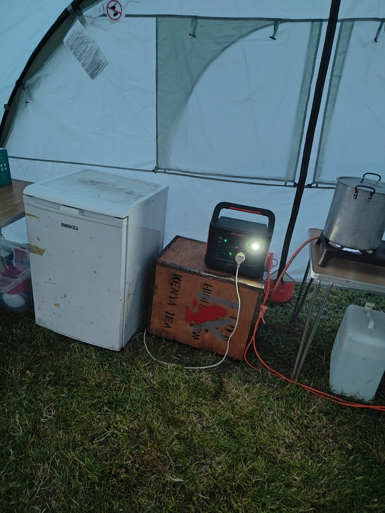
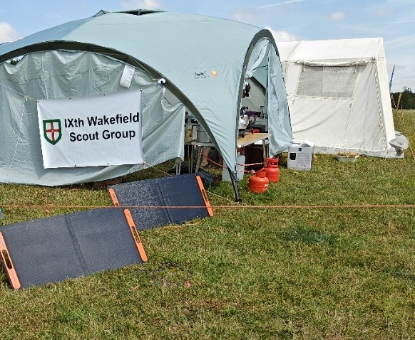

This weekend I attended a large Scout Camp called Challenge 26 as a cub leader. As a scout group we brought 5 adults and 30 young people to join 5,000 others at Bramham Park for 2 nights of glorious but hot weather, after a particularly hot start on a Friday with 30 degrees C well into the evening.  

## The problem ##

Summer camps have been a feature of scout camps since the very start. Smaller camps occur on dedicated campsites with basic features including indoor cooking, refrigeration and power. Large camps are truely greenfield, where apart from water you need to bring everything you need.  

Traditionally there have been two approaches to this problem. Some districts (a district is a collection of groups of around several hundred people) will provide central catering from large dedicated tents with lighting, large scale catering sized cooking equipment and refrigerated trailers powered by generators.  The other approach is each scout group of around 30-40 people caters by group. This usually involves smaller cooking equipment and the extensive use of coolboxes. Generators provide plenty of power, but are noisy and require fuel. Coolboxes might have worked in cooler temperatures, but the reality of modern British summers where 30 degrees is increasingly normal mean coolboxes will probably be unsufficiently cool by the 2nd night. On this camp we saw plenty of examples of both.

## Solar Curious ##

I have dabbled with different portable solar panels for camping, and then expanded out to include batteries and finally camping fridges. This gave me the opportunity to experiment, in the realive safety of family camping trips and smaller scout camps, where you are most concerned about keeping beverages cold, and are not dependant on the cold chain. Over time I assembled a collection of different panels and batteries and refrigeation. Through experimention I arrived at some understanding of actual realistic power output of panels, and typical power consumption.

## A new approach ##

With confiddence in my ability to create a workable solution, and with a big camp coming up I was able to suggest to my fellow scoup leaders that we ditched the coolboxes, and used active refidgeration. With the weather remaining warm, and the 3rd heatwave of the year predicted, this was going to be as the name suggested a challenge camp.

## Scaling the solution ##

With some calculations aided by Copilot I was able to come up with a plan, and calculate a 'power budget' for the camp. Unlike a generator which once fueled is usually start and forget, there's a certain amount of care and feeding with solar to ensure it all works to its full potential.  Ideally the load, the battery and the panels need to be sized correctly to work well together.

## The kit list ##

The kit I had assembled was as follows:
* Jackery Explorer 1000 v2 - a big powerful battery with 1000 watts/hour capacity and 12v, USB and two 240 v AC outputs.
* Jackery Explorer 240  - my first foray into batteries and a much smaller battery with 240 watts/hour capacity and 12v, USB and 240 v AC output.
* Anker Solix 521 - a more modern 250 watt/hour battery, with USB, mains and 12 v output.
* 2 x 100 watt Jackery SolarSaga solar panels
* 2 x Jackery solar extension cables (these extend the lead from the panel to the battery)
* 100 watt Renology folding panel
* 40 watt Jackery SolarSaga panel
* An Alpicool Y16T 16 litre camping fridge
* An Alpicool X50 50L camping fridge
* A smallish Beko domestic fridge

## Combing the parts ##

From this kit list I created three separate systems, each tuned for a different purpose. These could readily be applied to other situations.

### Individual setup ###

My son was on the Explorers section of the campsite and was keen have some cold drinks available, and keep his phone charged. To meet this requirement I combbined the smallest panel, fridge and battery.

* Jackery Explorer 240
* 40 watt Jackery SolarSaga solar panel
* 16 litre Alpicool fridge

### The fun fridge ###

On a hot camp, cold water and drinks are great for leader morale. Likewise milk that is still drinkable for breakfast and the endless tea and coffee that scout camps is important. For this requirement I combined the biggest and most powerful items together. Knowing the fridge would be opened frequently, I prioritised providing plenty of power to the fridge even if it wasn't the most important one.

* Jackery Explorer 1000 v2
* 2 x 100 watt Jackery SolarSaga solar panels
* Domestic fridge

### The food fridge ###

Feeding 30 hungry people over a weekend from a camp kitchen is a challnge. Our menu featured camp staples like sausages and bacon for breakfast and pasta with a mince sauce for dinner. As previously noted, keeping items bought on Friday morning at a safe temperature until Sunday morning, when just getting the food to camp in the back of an unairconditioned van in 34 degrees is a serious challenge to the cold chain.  Fortunatly, all the food fitted well inside the Alpicool GE50's massive 50 litre interior which was pretty close to a conventional coolbox in shape. As our plan was to open this only when needing to access food, and the fridge was well insulated, I decided the power requirements were actually quite modest, even though this was the fridge I most cared about temperature wise. To further help the battery, we prechilled the fridge before loading, and ran the fridge on 12 v on the way. 

* Alicool GE50 
* Anker Solix 521
* Renolgy 100 watt panel

##  Running the system ##

On arrival on Friday we powered up the fridges. Alas, the 2 Jackery solar panels didn't get plugged in properly (blame the confusion over the two different types of DC power connector and the ease of plugging in the wrong one which fits but doesn't connect), so the big battery had to cool the fridge and contents of drinks with no input, and took a hit over night and was down to 20% capacity in the morning. Worse yet the morning started misty, and there was very little power coming in.
The other systems fared better, as we got enough sunlight during the evening to go into the night with nearly full batteries.
During the day the sun came back, and the big battery started to fill up again. The domestic fridge was really struggling in the heat, and the layout of the cooking area meant sunlight was hitting the heat exchanger. Constant opening of the door didn't help either, so the fridge was drawing 60 watts most of the time. 
Fortunatly, the strong sunshine and periodic re-alignment to face the sun of the two jackery panels meant 190 watts was going into the battery pretty much all afternoon, and the battery reached the evening mostly full.  The extension cables really helped to allow some flexibility in placing the panels in the best possible position, and the battery in the most shaded spot.
The system with the Renology panel and the Anker Solix 521 and 50 litre fridge performed well enough. Even if the Renology panel struggled to hit 60 watts, it was enough to power the fridge which seemed to only draw 45 watts occasionally, and the battery gained power. Until we plugged a large Bose speaker in for some music which took a steady 20 watts off the 240 volt socket. Charging phones (which get used a lot for admin) added to the load, and the battery was down to the last few percent by midnight, and went offline some time in the night. As the night was cool, and the last item in the fridge was served at breakfast this was fine. The battery soon charged once the sun returned, but in hindsight, the speaker was a load I hadn't planned for, and we struggled to find enough power.

Meanwhile down in the Explorer camp, my son pointed the 40 watt panel in the general direction of the sun, put the battery and fridge in the shade and just left it. There was enough power to charge his phone, even if the jackery Explorer 240 battery was below 50% by the time we packed it up.

## Observations ##

Each setup worked well for its intended use:
* The small setup of a camping fridge, 40 watt panel and Jackery Explorer 240 worked pretty well for an individual setup, but wouldn't really scale to needs of a scout camp, unless it was a very small group.
* The 100 watt panel, 250 watt/hour battery and 50 litre fridge worked brilliantly together, and would be ideal for a weekend for a group of 20-30 people.
* The big setup of two 100 watt panels, a 1000 watt/hour battery and a domestic fridge worked well to the point where by Sunday evening the battery was full again.

## Lessons learned ##
* If value for money was a concern, spending more money on an efficient camping fridge, and less money on smaller battery and panel could be more cost effective. The power consumption of the camping fridge was half that of the domestic fridge for a similar volume. Doubling hte capacity of a solar system (battery and panels) is expensive. 
* Don't forget the power consumption of other loads - powered a large speaker, and constantly charging phones put a dent into the battery. Ideally put these loads on a separate battery to the essential food fridge to avoid the possibility of a dead fridge.
* Domestic fridges are power hogs. With a relatively inefficient compressor, a front loading door (which lets all the cold air out each time its opened), and frequent opening, the domestic fridge was using twice as much power as the camping fridge. For our use case of the "fun fridge" this worked pretty well, but this tied up a lot of valuable equipment for a trivial task.
* Don't under estimate the additional load of opening the fridge and adding warm items. Each time that happens, the fridge has to draw extra power to keep the same temperature.
* Not all panels reach their rated output. The Jackery 100 watt panels came very close.
* Spending some time turned the panels to face the sun every hour maximises output.
* Extension cables are surprisingly useful. Keeping panels in the sun, and batteries and fridge in the cold makes the most of the system. 

## Following up ##

By the end of the camp, the group had taken to referring to the setup as "the solar farm" suggesting my idea had gone from one of my mad ideas to acceptance. Our position at the end of a row, by one of the many access routes meant plenty of passersby stopped to ask about the setup, and I was able to give a quick demo of the system. 
After some initial skeptism, one of my fellow scout leaders is borrowing the small setup for a week long camp where his specific dietary requirements mean he wants to provide his own food. However, to build in a little bit of resilience for those not so sunny days, we have swapped the 40 watt panel for a 100 watt panel, to ensure there's enough power collected even on dull days.

## Tips ###

* **Extension leads help a lot**. They allow you place the panels in the sun and the load and battery in the shade maximising the power output and lowering power consumption.
* **Use the 12 volt supply for the camping fridges**. Stepping up the battery to 240 volts AC and back down to 12 with the external power supply for the fridge is wasted energy that could be used elsewhere.
* **Phones consume a lot more power than you expect**. Hot conditions, and scout admin done online, combined with terrible bandwidth chew through phone batteries requiring multiple charges per day. With multiple adults with phones this is actually quite a lot of extra load to consider.
* **Domestic appliances are hungry for power**. At home you don't need to think about power consumption much. When running on batteries, you need to be mindful of power all the time. Even leaving the fridge door open on a hot day.
* **Not all panels hit their nameplate output**. The Jackery 100 watt panels do. The 40 watt panel gets 20-25 watts on a good day, but due to it's folding structure and lack of stand it wasn't well aimed.  The renology 100 got around 50-60 watts at best.
* **Follow the sun**. To get anything like the state output you will need to position the panels to face the sun and move them to follow the sun every hour. Even in direct sunlight a panelthat's not well aligned will not reach it's full output.

